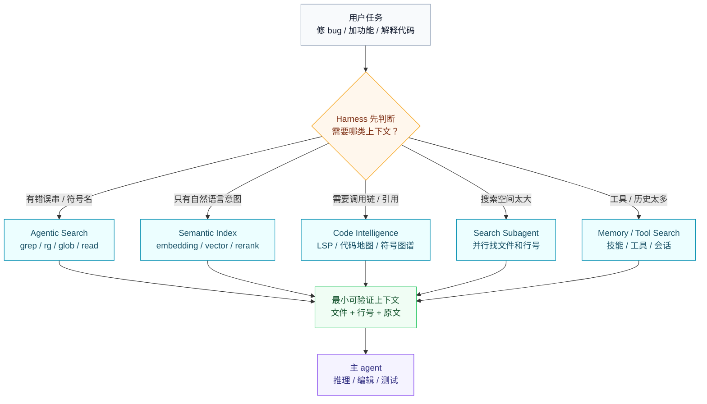
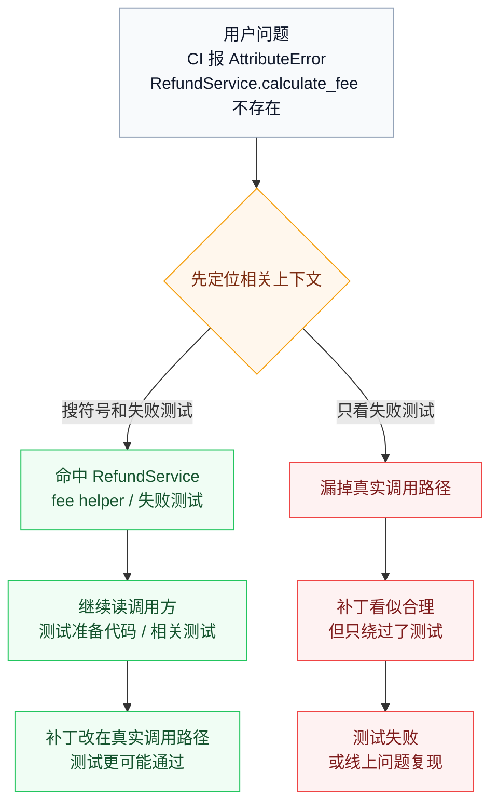
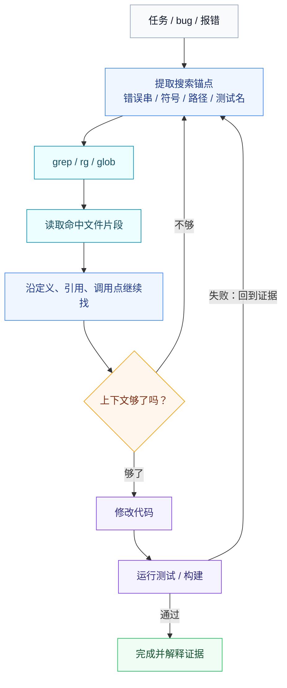
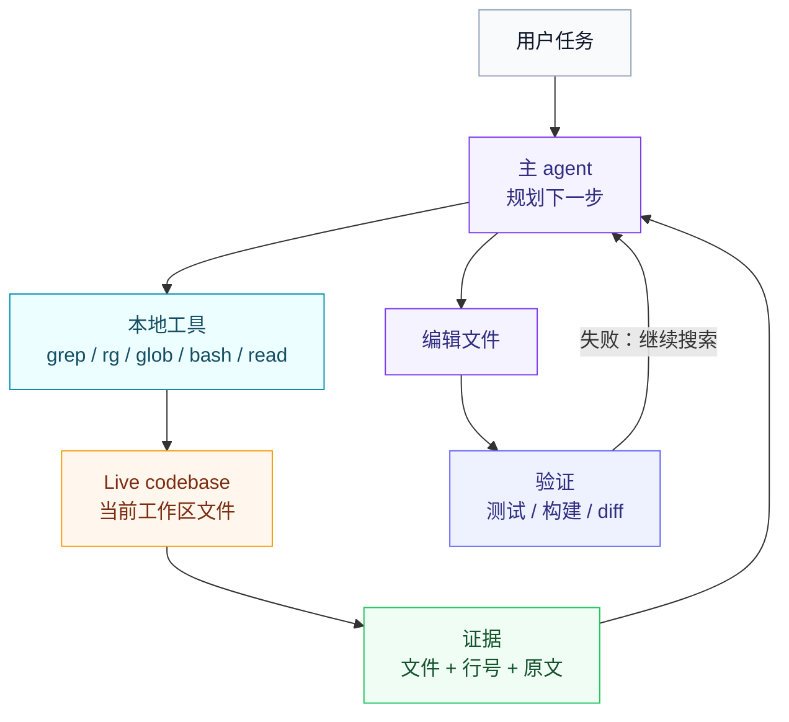
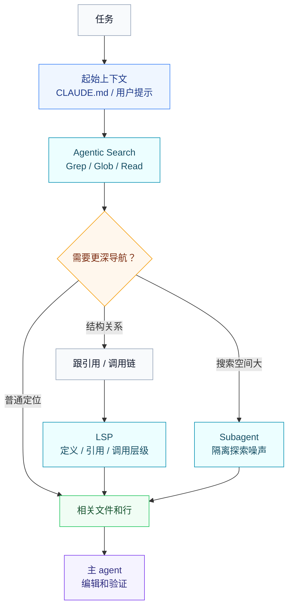
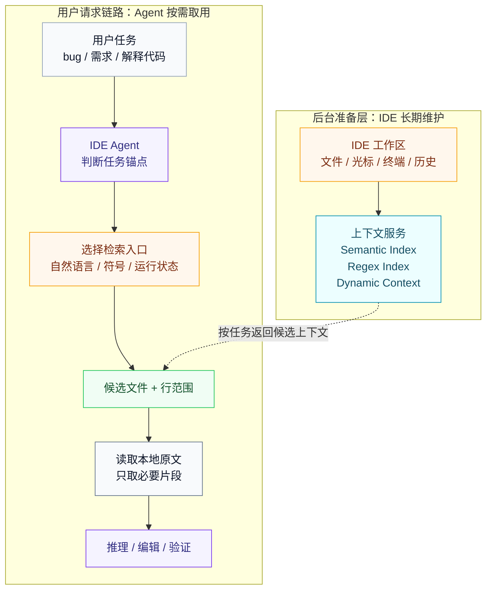
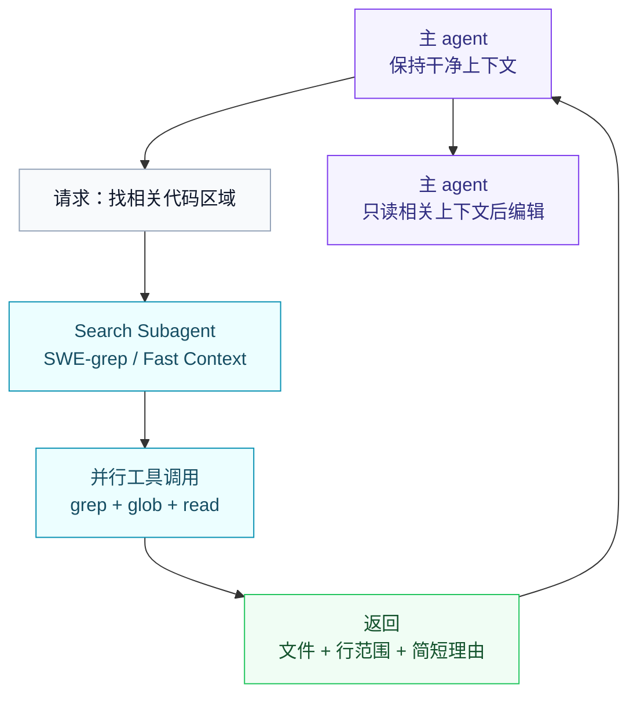
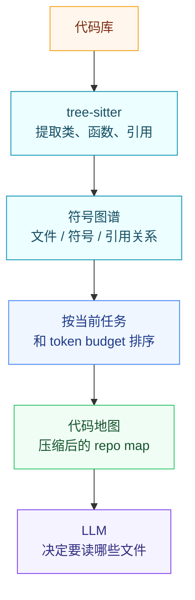
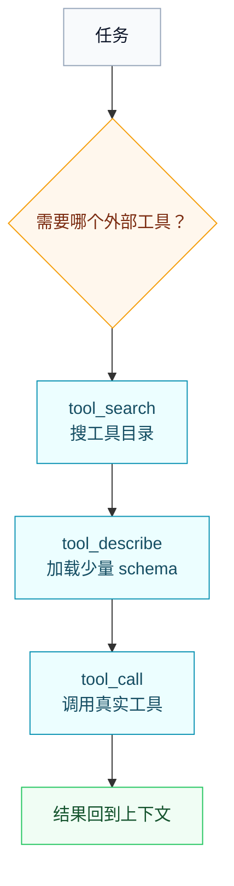
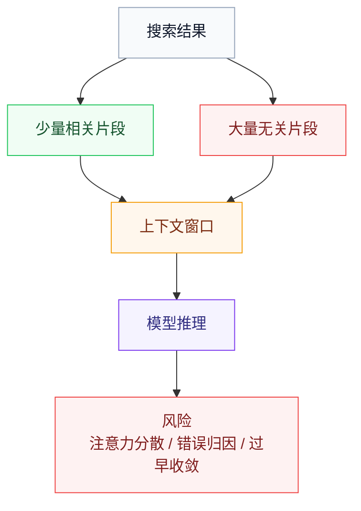

> 过去两年，很多人把“代码库检索”自然联想到 embedding 和向量索引。但真实 coding agent 的默认入口往往更朴素：grep、glob、read、语言服务器协议（LSP）、代码地图、工具检索和子 agent 仍然是核心能力。

## 先给结论

主流 agent harness 的检索方式可以压缩成五类：

| 名称 | 一句话解释 | 代表 |
| --- | --- | --- |
| **Agentic Search** | 让模型自己用 grep/glob/read/shell 一步步找上下文 | Codex、Claude Code、Gemini CLI、OpenCode |
| **Semantic Index** | 预先把代码切块、向量化，查询时召回相关片段 | Cursor、Windsurf |
| **Code Intelligence** | 用代码地图、语言服务器协议（LSP）、AST、符号图谱补上结构化导航 | Aider、Claude Code LSP、OpenCode LSP |
| **Search Subagent** | 专门训练或调度一个小 agent 来找文件和行号 | SWE-grep / Windsurf Fast Context |
| **Memory / Tool Search** | 检索工具、技能、历史会话、长期记忆，而不是只检索代码 | Hermes、Claude ToolSearch、Cursor dynamic context |

这五类不是互斥关系。我判断 2026 年的趋势是混合检索（Hybrid Search），原因不是向量数据库“更先进”，也不是 grep “赢了”。更准确地说，公开材料里有几条信号正在同时出现：

- Claude Code 的大代码库实践强调本地读文件、grep、跟引用，同时又在使用 LSP、MCP、skills、subagents 扩展上下文。[[4]](https://claude.com/blog/how-claude-code-works-in-large-codebases-best-practices-and-where-to-start)
- Cursor 2026 年的几篇公开工程文章分别写到 semantic indexing、fast regex search、dynamic context discovery 和 harness eval。这不是“公开路线图”，但能说明它在产品工程上不是单一路线。[[6]](https://cursor.com/blog/secure-codebase-indexing) [[7]](https://cursor.com/blog/fast-regex-search) [[8]](https://cursor.com/blog/dynamic-context-discovery) [[9]](https://cursor.com/blog/continually-improving-agent-harness)
- SWE-grep / Fast Context 把“找相关文件和行号”拆成专门的 Search Subagent，目标是减少主 agent 的上下文污染。[[10]](https://cognition.ai/blog/swe-grep)
- Aider 的代码地图（repo map）、Codebase-Memory、CodeCompass 这类方向都在补充结构化导航，也就是代码地图和符号图谱。[[11]](https://aider.chat/docs/repomap.html) [[23]](https://arxiv.org/abs/2603.27277) [[24]](https://arxiv.org/abs/2602.20048)
- Hermes Tool Search 说明，当工具足够多时，工具 schema 本身也要被检索，而不是全塞进上下文。[[15]](https://hermes-agent.nousresearch.com/docs/user-guide/features/tool-search)

写这类文章时有一个容易混淆的词：RAG。很多工程讨论会把 RAG 简化成“向量库 + embedding + top-k chunk”，所以一看到 Claude Code、Codex 这类 CLI agent 主要用 grep / read / shell，就会说它们“没有 RAG”。但如果按 Retrieval-Augmented Generation 的字面意思，关键动作其实是“先检索，再把检索结果交给模型生成”。Hacker News 那串讨论里，Simon Willison 也明确把 ripgrep 这类检索纳入广义 retrieval。[[27]](https://news.ycombinator.com/item?id=43164253)

因此，后文不是要证明“grep 打败了 RAG”。更准确的铺垫是：**grep 本来就是 retrieval，只是它不是 vector retrieval。** 真正值得讨论的是：agent harness 什么时候该用精确文本检索，什么时候该用语义索引，什么时候该交给 LSP、代码地图或 Search Subagent。



## 为什么检索很重要

coding agent 写代码之前，首先要知道“该看哪些文件”。这一步如果错了，后面的推理再强也容易走偏。

换一个更直观的代码例子：用户说“CI 里 `tests/payment/test_refund.py::test_refund_keeps_fee` 失败，报 `AttributeError: 'RefundService' object has no attribute 'calculate_fee'`”。这类问题不是让模型凭空写逻辑，而是要先定位“这个符号现在叫什么、谁在调用、测试为什么还在用旧名字”。真正相关的上下文可能分散在四个地方：

- 失败测试 `tests/payment/test_refund.py`；
- `RefundService` 的当前实现；
- 最近重命名后的 fee 计算函数；
- 仍然调用旧方法名的业务入口或测试准备代码。

如果 agent 只读失败测试，它可能会把测试改成新名字，看似让一个用例过了，但真实调用路径还在坏；如果它先搜 `calculate_fee` 和 `RefundService`，再读实现、调用方和测试，就更可能修到正确位置。如果它把整个 `payment/`、`billing/`、`tests/` 都塞进上下文，又会带来大量噪声。



这说明：仓库级修复天然把“定位上下文”变成隐含前提。SWE-bench 本身不是上下文检索（context retrieval）评测，它主要评估真实 GitHub issue 的 patch 能否通过测试；但它让研究者更清楚地看到，最终成败经常取决于 agent 有没有先找对文件和代码区域。[[16]](https://www.swebench.com/original.html) 后续 ContextBench、SWE Context Bench、SWE-Explore、CORE-Bench 才更直接地把“找对代码区域”拆出来评估：agent 到底有没有找到足够、准确、不过量的代码上下文。[[17]](https://arxiv.org/abs/2602.05892) [[18]](https://arxiv.org/abs/2602.08316) [[19]](https://arxiv.org/abs/2606.07297) [[20]](https://arxiv.org/abs/2606.11864)

## 为什么大家还在用 Agentic Search

代码和普通文档不一样。很多问题天然有精确锚点：函数名、类名、错误消息、日志文本、测试名、配置 key、API path、SQL 表名、环境变量。只要锚点存在，ripgrep（命令名是 `rg`）往往比向量检索更直接、更可解释、更容易复查。ripgrep 是开发者常用的递归文本搜索工具，速度快；默认会尊重 `.gitignore`，也就是跳过 Git 已声明忽略的目录和文件，除非显式加 `--no-ignore` 这类参数。[[12]](https://github.com/BurntSushi/ripgrep) 所以很多 agent harness 会优先把它暴露给模型。

Agentic Search 的基本流程很朴素：



这条路线的优势很清楚：

- **没有冷启动**：打开任意 repo 就能工作，不等索引。
- **读的是 live codebase**：不会因为索引滞后而引用被删除或重命名的代码。
- **权限边界简单**：本地 grep、本地读文件，和开发者当前工作区一致。
- **结果可审计**：文件路径、行号、原文片段都能复查。
- **适合写代码的闭环**：搜、读、改、测是一条连续链路。

代价也同样清楚：

- 搜索会变成多轮串行操作，慢。
- 模型 query 写得不好时，会绕远路。
- grep 结果可能把大量无关 token 带进上下文。
- 对“命名不一致、关键词搜不到”的架构依赖、动态调用、跨语言边界不够强。

这就是为什么下一步不是“放弃 grep”，而是把 grep 变得更快、更结构化、更少污染主上下文。

## 两类有公开来源支撑的检索轨迹

这两类轨迹都有公开材料可对照：Claude Code 公开文章描述了“本地文件系统 + grep + read + 跟引用”的导航方式；SWE-grep 公开文章描述了“并行 grep / glob / read，最后返回文件和行范围”的 Search Subagent。[[4]](https://claude.com/blog/how-claude-code-works-in-large-codebases-best-practices-and-where-to-start) [[10]](https://cognition.ai/blog/swe-grep)

### 轨迹 A：Claude Code / CLI agent 的本地 Agentic Search

这类轨迹适合有硬锚点的问题，比如测试名、错误字符串、函数名、文件路径。它的特点是边搜边读，不需要先等完整索引建好。

```text
用户：CI 里 test_refund_keeps_fee 失败，
     报 AttributeError: RefundService.calculate_fee 不存在

1. 提取硬锚点：
   - test_refund_keeps_fee
   - RefundService
   - calculate_fee

2. rg "test_refund_keeps_fee|calculate_fee|class RefundService" tests src
   -> 找到失败测试、服务类、旧方法名残留调用点

3. read 命中文件的关键片段
   -> 确认 calculate_fee 是否被重命名、移动或拆分

4. 继续沿引用找调用方
   -> 读 refund route / 测试准备代码 / 相关测试

5. 只把失败测试、服务实现、真实调用方带入主推理
   -> 改代码、跑测试、再根据结果回到搜索
```

这里好的地方是：第一步不猜测业务逻辑，而是先抓住测试名和符号名这两个硬证据。后面每扩大一步，都有文件路径、行号或调用关系作为依据。

### 轨迹 B：SWE-grep / Fast Context 的 Search Subagent

这类轨迹适合搜索空间太大、主 agent 不应该亲自读大量噪声的情况。Cognition 的公开文章说，SWE-grep 的设计目标就是让检索子 agent 并行调用 grep、glob、read，并把结果压成文件和行范围，而不是给主 agent 一段自由摘要。[[10]](https://cognition.ai/blog/swe-grep)

```text
用户：这个仓库里权限校验可能有绕过风险，帮我定位入口

1. 主 agent 不直接读完整 auth/、api/、middleware/

2. search subagent 并行探索：
   - rg "authorize|permission|policy|role|guard"
   - glob "**/*auth*"
   - glob "**/*middleware*"
   - read 命中文件的相关行范围

3. search subagent 返回结构化结果：
   - src/middleware/authz.ts:42-91
   - src/routes/admin.ts:18-55
   - src/policies/rolePolicy.ts:10-64
   - tests/authz/adminRoute.test.ts:1-80

4. 主 agent 只读取这些范围，再决定是否继续扩大搜索
```

这里好的地方是：探索噪声留在 Search Subagent，主 agent 拿到的是文件、行号和简短理由。这也更容易评测，因为 file F1、line F1 和 latency 都可以被单独看。

## 主流工具怎么做

### CLI agent：在当前代码库里实时取证

Codex、Claude Code、Gemini CLI、OpenCode 形态相近：模型进入本地工作区，用 grep/glob/read/bash/edit 这类工具，一步步找上下文、改文件、跑测试。它们的共同点不是“都在终端里”，而是 **把当前文件系统和 shell 暴露成可审计工具，让 agent 从 live codebase 里实时取证**，不要求先构建完整的远端代码索引。[[1]](https://github.com/openai/codex) [[4]](https://claude.com/blog/how-claude-code-works-in-large-codebases-best-practices-and-where-to-start) [[13]](https://google-gemini.github.io/gemini-cli/docs/tools/file-system.html) [[14]](https://opencode.ai/docs/tools/)



这很符合 CLI agent 的约束：它要能在任何机器、任何 repo、任何目录下立刻开始工作。预先维护一个完整向量索引，对这类工具不是最稳的默认选择。

但几家工具的侧重点不完全一样。

#### Codex：把本地搜索工具打包进默认工作流

这里的“公开源码”指 OpenAI 在 GitHub 公开的 Codex CLI 仓库，不是说所有 Codex 产品形态都开源。就这个公开仓库和文档看，Codex CLI 的默认代码检索更接近 Agentic Search：模型在本地工作区里使用 shell、`rg`、读文件和 patch 工具。Codex CLI 公开源码里有 fuzzy file search，但它主要解决的是文件名/路径选择，不是 IDE 式的全局 semantic code index。[[1]](https://github.com/openai/codex) [[2]](https://github.com/openai/codex/tree/main/codex-rs/file-search)

公开源码里能看到两个小但很有代表性的信号。第一，Codex 打包时会把 ripgrep 放进自己的 `codex-path`，也就是把 `rg` 作为本地可执行工具随包分发。下面是关键行摘录：[[2]](https://github.com/openai/codex/blob/c09df9e35319/scripts/codex_package/layout.py#L43-L54)

```python
path_dir = package_dir / "codex-path"
path_dir.mkdir()
copy_executable(inputs.rg_bin, path_dir / spec.rg_name, ...)
```

第二，Codex 的 file search 使用路径 fuzzy match。这里的 `match_paths()` 和 Nucleo 更像“按路径/文件名快速挑文件”，不是把代码内容切块后做 embedding 召回：[[3]](https://github.com/openai/codex/search?q=match_paths&type=code)

```rust
let nucleo = Nucleo::new(
    Config::DEFAULT.match_paths(),
    notify,
    ...,
);
```

#### Claude Code：Agentic Search + 分层上下文

Anthropic 在 2026-05-14 的文章 [How Claude Code works in large codebases: Best practices and where to start](https://claude.com/blog/how-claude-code-works-in-large-codebases-best-practices-and-where-to-start) 里直接描述了 Claude Code 的导航方式：本地遍历文件系统、读文件、用 grep 找需要的内容、沿引用继续找；不要求先构建或上传代码库索引。文章同时指出，Agentic Search 的代价是需要足够好的起始上下文，否则模型会在大代码库里盲找。[[4]](https://claude.com/blog/how-claude-code-works-in-large-codebases-best-practices-and-where-to-start)



这里的 LSP 指 Language Server Protocol，也就是编辑器常用的“跳到定义、找引用、调用层级、诊断”的协议。它不是替代 grep，而是补上“只靠关键词不好找”的结构化导航。

这也是 Claude Code 现在的重点：不是把所有知识塞进 prompt，而是通过 CLAUDE.md、skills、hooks、plugins、MCP、LSP、subagents 做分层上下文。[[4]](https://claude.com/blog/how-claude-code-works-in-large-codebases-best-practices-and-where-to-start) [[5]](https://code.claude.com/docs/en/tools-reference)

Hacker News 在 2025-02-24 的帖子 [Claude 3.7 Sonnet and Claude Code](https://news.ycombinator.com/item?id=43163011) 里，Boris Cherny 的评论提到 Claude Code 当时不用 RAG，并认为 Agentic Search 更适合 Code 的使用场景。这个说法要带着语境看：那里说的 RAG 基本是在指 vector RAG，而不是广义的 retrieval-augmented generation。对应评论链接是 [HN comment thread](https://news.ycombinator.com/item?id=43164253)。[[26]](https://news.ycombinator.com/item?id=43163011) [[27]](https://news.ycombinator.com/item?id=43164253)

#### Gemini CLI / OpenCode：文件系统工具 + shell + 可选结构化导航

Gemini CLI 和 OpenCode 与 Codex、Claude Code 放在一起看，关键不在界面形态，而在于基础能力正在趋同：read、grep/search、glob、bash、edit/write 正在变成 CLI agent 的常用工具集合；差异主要落在权限、UI、模型接入、上下文管理和是否引入 LSP 这类结构化工具。[[13]](https://google-gemini.github.io/gemini-cli/docs/tools/file-system.html) [[14]](https://opencode.ai/docs/tools/)

Gemini CLI 的公开源码里能看到一个典型 fallback：路径直接找不到时，如果开启了 recursive file search，就尝试用 glob 做递归文件搜索。[[13]](https://github.com/google-gemini/gemini-cli/search?q=getEnableRecursiveFileSearch&type=code)

```ts
if (config.getEnableRecursiveFileSearch() && globTool) {
  const globResult = await globTool.buildAndExecute({
    pattern: `**/*${pathName}*`,
    path: dir,
  });
}
```

OpenCode 的工具规范里，`grep` 是一等工具，最后落到文件系统搜索：[[14]](https://github.com/sst/opencode/blob/318dbe93ba92/specs/v2/tools.md#L103-L126)

```ts
grep: Tool.make({ description: "Search file contents", ... })
return yield* filesystem.grep(input, root)
```

OpenCode 还把 LSP 做成可选工具，支持 go to definition、find references、workspace symbol、call hierarchy 等结构化查询。[[14]](https://github.com/sst/opencode/search?q=workspace+symbol+call+hierarchy&type=code)

```ts
case "goToDefinition": return lsp.definition(position)
case "findReferences": return lsp.references(position)
case "workspaceSymbol": return lsp.workspaceSymbol(args.query ?? "")
```

### IDE agent：索引、grep、编辑器上下文一起用

Cursor 更像 IDE harness。它有长期工作区、编辑器状态、索引缓存、团队共享能力，所以它自然会做 semantic index。但 Cursor 2026 年几篇工程文章也说明了一件事：**即使有 semantic index，agent 仍然爱用 grep。** 这不是我说 Cursor “公开了路线图”，而是说它公开的工程文章能反映出实际 harness 设计正在走混合检索。[[6]](https://cursor.com/blog/secure-codebase-indexing) [[7]](https://cursor.com/blog/fast-regex-search) [[8]](https://cursor.com/blog/dynamic-context-discovery) [[9]](https://cursor.com/blog/continually-improving-agent-harness)

可以拆成两层看：IDE 在后台长期维护上下文服务；用户提问后，Agent 只向这个服务取候选文件和行范围，再读取必要原文。



这比“Cursor 是 RAG，Claude Code 是 grep”更准确。Cursor 在做的是混合检索：

- Semantic Index 解决自然语言召回。[[6]](https://cursor.com/blog/secure-codebase-indexing)
- Fast Regex Search 解决大 monorepo 下 `rg` 太慢的问题。[[7]](https://cursor.com/blog/fast-regex-search)
- Dynamic Context Discovery 把 MCP tools、终端输出、历史对话等变成可按需搜索的文件。[[8]](https://cursor.com/blog/dynamic-context-discovery)
- Harness eval 和在线反馈决定这些上下文什么时候该给模型。[[9]](https://cursor.com/blog/continually-improving-agent-harness)

这里的关键观察是：IDE agent 可以承担索引成本，因为它长期住在你的项目里；CLI agent 更倾向于 live search，因为它要随时进入任意目录。

Cursor 这组公开工程文章是“混合检索”的典型例子：一边做 codebase semantic index，一边又专门做 fast regex search，还把终端输出、MCP tool descriptions、历史对话变成可动态发现的上下文。它不是“只用 embedding”，而是在不同场景下路由到不同检索层。

### Search Subagent：把“找上下文”拆成专门任务

Cognition 在 2025-10-16 发布 SWE-grep / Fast Context，把问题说得很直接：现代 coding agent 在动手改文件前，经常把大量时间花在找上下文上。Embedding Search 快但可能不准；Agentic Search 灵活但慢，还会污染主上下文。[[10]](https://cognition.ai/blog/swe-grep)

他们的解法不是二选一，而是训练一个专门做 context retrieval 的 subagent：



这条路线很有前途，因为“找相关文件和行号”比“写一段自由摘要”更容易评估，也更不容易误导主 agent。

### 代码地图：先给模型一张压缩的项目地图

Aider 的代码地图（repo map）不是搜索引擎，而是给模型一张压缩后的代码地图。它用 tree-sitter 提取符号，再用符号图谱排序挑出当前最重要的文件、类、函数和签名。[[11]](https://aider.chat/docs/repomap.html)



这解决的是“模型一开始不知道代码库长什么样”的问题。它不会替代读文件，但能减少盲搜。

### Tool Search：工具太多时，工具本身也要被检索

Hermes 的 Tool Search 很适合说明另一个趋势：agent harness 的检索对象不再只是代码。MCP server、plugin tools、session memory、browser、web search、delegate task 这些工具越来越多，如果每轮都把所有 JSON schema 塞进上下文，成本很快失控。[[15]](https://hermes-agent.nousresearch.com/docs/user-guide/features/tool-search)



Hermes 的选择是 progressive disclosure：只暴露桥接工具，具体工具 schema 用到时再加载。这个方向和 Claude skills、Cursor dynamic context、Codex skills/plugins/MCP 是同一个大趋势：**上下文按需加载，而不是一次性塞满。** [[15]](https://hermes-agent.nousresearch.com/docs/user-guide/features/tool-search) [[8]](https://cursor.com/blog/dynamic-context-discovery) [[5]](https://code.claude.com/docs/en/tools-reference)

## 为什么不是简单上 Semantic Index

Semantic Index 很有用，尤其适合“我不知道内部命名，只知道自然语言意图”的问题。比如“哪里做了权限校验”“哪里下载远端文件”“哪个模块负责账单对账”。这些问题没有稳定关键词，embedding 往往比 grep 更容易给出第一批候选。

但在代码场景里，Semantic Index 有几个天然问题：

- **索引会过期**：活跃团队里，函数重命名、模块删除、文件移动都很常见。
- **chunk 不等于可改上下文**：一个语义相关片段未必包含调用者、测试、边界条件。
- **top-k 会制造错觉**：模型看到“看起来相关”的片段后，可能过早收敛。
- **成本和合规更重**：需要切块、embedding、增量同步、权限控制、隐私策略。

所以 Semantic Index 更适合作为混合检索的一层，而不是唯一入口。Cursor 也没有停在 Semantic Index，而是继续做 regex index 和 dynamic context。[[6]](https://cursor.com/blog/secure-codebase-indexing) [[7]](https://cursor.com/blog/fast-regex-search) [[8]](https://cursor.com/blog/dynamic-context-discovery)

## 真正难的是 context pollution

agent 找上下文时最容易犯的错，不是“没有搜索”，而是“读了太多没用的东西”。上下文窗口变大以后，这个问题没有消失，只是更隐蔽。SWE-grep 和 ContextBench 都把 precision / line range / token efficiency 放到评估里，原因就在这里。[[10]](https://cognition.ai/blog/swe-grep) [[17]](https://arxiv.org/abs/2602.05892)



这也是为什么 2026 年的方向会从“召回更多”转向“带来源地召回更少”：

- 返回文件和行范围，而不是长摘要。
- 让主 agent 能继续打开原文验证。
- 用 precision、line F1、latency 评价检索，而不是只看最终任务是否通过。
- 把探索噪声隔离到 subagent，主 agent 只接收浓缩后的证据。

## 评测信号：我们应该怎么判断检索好不好

这里看几个共同指向的评测信号。

**第一，仓库级修复天然要求先找上下文。** SWE-bench 这类广泛使用的基准把任务放在真实 GitHub issue 和真实代码库里，模型要生成能通过测试的 patch。这个设定已经不再是“写一个函数”，而是“在一个已有仓库里找到该改哪里”。所以检索不是附属步骤，而是解题链路的一部分。[[16]](https://www.swebench.com/original.html)

**第二，检索要单独评估。** ContextBench、SWE Context Bench、SWE-Explore、CORE-Bench 这类更新的工作把 coding agent 的“是否找到了正确上下文”从最终 pass rate 里拆出来，看 file/block/line 级别的 recall、precision、ranking 和 efficiency。这比只问“任务最后过没过”更接近问题本身。[[17]](https://arxiv.org/abs/2602.05892) [[18]](https://arxiv.org/abs/2602.08316) [[19]](https://arxiv.org/abs/2606.07297) [[20]](https://arxiv.org/abs/2606.11864)

**第三，grep 是强 baseline，但不是宗教。** 2026 年围绕 grep、vector retrieval、agent harness 的实验都在说明一件事：grep 在代码里非常强，尤其有函数名、错误消息、测试名这类字面关键词时；但结果强弱很依赖工具输出怎么呈现、模型怎么调用工具、harness 怎么控制上下文。[[21]](https://arxiv.org/abs/2605.15184) [[22]](https://arxiv.org/abs/2601.23254)

**第四，符号图谱和结构导航补的是另一类问题。** Codebase-Memory、CodeCompass、Aider 代码地图这类方向说明，隐藏依赖、调用链、跨文件结构不一定能靠关键词解决。LSP、代码地图、符号图谱不会替代 grep，但会减少盲搜。[[23]](https://arxiv.org/abs/2603.27277) [[24]](https://arxiv.org/abs/2602.20048) [[11]](https://aider.chat/docs/repomap.html)

**第五，速度本身也是成功信号。** SWE-grep 把 latency 和 file/line F1 放在一起看，不只是因为用户等待会被打断，更因为检索越早命中正确文件和行范围，主 agent 后续越少在错误分支上消耗上下文和工具调用。换句话说，快常常不是单纯的体验指标，而是“搜对方向”的外显信号。[[10]](https://cognition.ai/blog/swe-grep) [[17]](https://arxiv.org/abs/2602.05892)

## 2025-2026 的社区信号

**Karpathy：从 prompt engineering 到 context engineering。** 2025 年 Karpathy 对 context engineering 的定义被大量引用：关键不是写一句神奇 prompt，而是把下一步所需的正确信息放进上下文窗口。这句话解释了为什么检索会成为 agent harness 的核心能力。[[25]](https://x.com/karpathy/status/1937902205765607626)

**Boris / Claude Code：Agentic Search 不是偶然。** 2025 年 Hacker News 讨论里，Boris Cherny 提到 Claude Code 当时没有使用 RAG，并认为 Agentic Search 更适合 Code 的用途。到了 2026 年，Anthropic 官方文章把这个实践写得更完整：本地文件系统、grep、读文件、跟引用，不依赖集中式代码库索引。[[26]](https://news.ycombinator.com/item?id=43163011) [[27]](https://news.ycombinator.com/item?id=43164253) [[4]](https://claude.com/blog/how-claude-code-works-in-large-codebases-best-practices-and-where-to-start)

**Simon Willison：RAG 不该被窄化成 vector search。** Simon 在 Hacker News 同一串讨论里强调，检索内容来增强生成就可以算 RAG，ripgrep 也是一种 retrieval。2026 年他开始系统整理 “Agentic Engineering Patterns”，这个命名也很准确：现在的工程重点已经从“让模型补全代码”变成“设计 agent 能可靠工作的工程流程”。[[27]](https://news.ycombinator.com/item?id=43164253) [[28]](https://simonwillison.net/2026/Feb/23/agentic-engineering-patterns/)

**Armin Ronacher：Make it greppable。** Armin 2026 年写到，agent 很依赖 grep 这类外部工具；代码如果难以 grep，或者真实信息藏在重导出、宏、别名、动态结构里，agent 会更容易迷路。他还强调 subagent 和文件系统作为共享工作区的重要性：探索失败、临时产物、工具结果都不应该无控制地挤进主上下文。[[29]](https://lucumr.pocoo.org/2026/2/9/a-language-for-agents/) [[30]](https://lucumr.pocoo.org/2025/11/21/agents-are-hard/)

**Cursor 工程团队：agent 仍然爱 grep。** Cursor 2026 年 Fast Regex Search 的文章开头就把现象讲得很直：LSP 已经成熟，agentic coding 到来以后，agent 还是很爱用 grep。Cursor 的做法不是否认这一点，而是给 regex search 建索引，把 grep 这件事产品化、加速化。[[7]](https://cursor.com/blog/fast-regex-search)

这几条社区信号对应的原文入口如下：

| 信号 | 原文入口 |
| --- | --- |
| Context engineering | Karpathy X 原帖 [[25]](https://x.com/karpathy/status/1937902205765607626) |
| Claude Code / Hacker News 讨论 | Hacker News 帖子《Claude 3.7 Sonnet and Claude Code》[[26]](https://news.ycombinator.com/item?id=43163011)，评论串 [[27]](https://news.ycombinator.com/item?id=43164253) |
| Agentic Engineering Patterns | Simon Willison 文章 [[28]](https://simonwillison.net/2026/Feb/23/agentic-engineering-patterns/) |
| Make it greppable / agent 设计 | Armin Ronacher 文章 [[29]](https://lucumr.pocoo.org/2026/2/9/a-language-for-agents/) [[30]](https://lucumr.pocoo.org/2025/11/21/agents-are-hard/) |
| Cursor fast regex | Cursor 工程文章 [[7]](https://cursor.com/blog/fast-regex-search) |

这些信号合在一起，说明行业的关注点已经变了：模型当然重要，但 harness、检索、上下文预算、工具输出和评测同样重要。

## 我对未来的判断

- **默认会变成混合检索。** grep、Semantic Index、LSP、代码地图、记忆、工具检索都会存在，harness 负责路由。
- **Search Subagent 会越来越常见。** 主 agent 不该亲自读完所有噪声；搜索可以被训练、并行化、低延迟化。
- **返回结果会更像 citation。** 文件、行号、原文片段、来源和置信度会比自由摘要更重要。
- **Code Intelligence 会进入 agent 工具箱。** LSP、调用层级、引用查找、依赖图谱会补上 grep 的盲区。
- **工具和记忆也会被检索。** 当 MCP、skills、plugins、session history 变多，检索对象会从“代码文件”扩展到“agent 的整个工作环境”。
- **更大的 context window 不会解决全部问题。** 它只会让 context pollution 更晚暴露。真正的能力是选择、压缩、隔离和验证上下文。

## 结尾：grep 不是倒退，是一个现实的默认值

2026 年最强 coding agent 还在用 grep，不是因为大家不知道向量数据库，也不是因为 IDE 索引没有价值。

原因更朴素：代码有大量精确锚点；本地 live search 可审计、低冷启动、权限清晰；agent 写代码需要的是能验证、能 patch、能跑测试的上下文，而不只是“语义上相似”的片段。

但 grep 也不是终点。未来的好 agent harness 会像一个谨慎的工程师：先用最便宜、最确定的方式找证据；不够时再用 Semantic Index；遇到结构关系就用 LSP、代码地图和符号图谱；信息太多就交给 Search Subagent；工具太多就先搜工具；历史太长就搜记忆。

换句话说，真正的竞争不在于“谁用了 RAG”，而在于谁能在每一步给模型**刚好够用、可验证、不过量**的上下文。

## 资料索引

### 官方与产品工程

- [1] [OpenAI Codex CLI GitHub public repository](https://github.com/openai/codex)
- [2] Codex packaging / file-search evidence: [file-search package](https://github.com/openai/codex/tree/main/codex-rs/file-search), [layout.py ripgrep excerpt](https://github.com/openai/codex/blob/c09df9e35319/scripts/codex_package/layout.py#L43-L54)
- [3] [Codex file-search Nucleo source lookup](https://github.com/openai/codex/search?q=match_paths&type=code)
- [4] [How Claude Code works in large codebases: Best practices and where to start](https://claude.com/blog/how-claude-code-works-in-large-codebases-best-practices-and-where-to-start)
- [5] [Claude Code tools reference](https://code.claude.com/docs/en/tools-reference)
- [6] [Cursor: Securely indexing large codebases](https://cursor.com/blog/secure-codebase-indexing)
- [7] [Cursor: Fast regex search: indexing text for agent tools](https://cursor.com/blog/fast-regex-search)
- [8] [Cursor: Dynamic context discovery](https://cursor.com/blog/dynamic-context-discovery)
- [9] [Cursor: Continually improving our agent harness](https://cursor.com/blog/continually-improving-agent-harness)
- [10] [Cognition: Introducing SWE-grep and SWE-grep-mini](https://cognition.ai/blog/swe-grep)
- [11] [Aider repo map](https://aider.chat/docs/repomap.html)
- [12] [ripgrep GitHub](https://github.com/BurntSushi/ripgrep)
- [13] Gemini CLI: [file system tools](https://google-gemini.github.io/gemini-cli/docs/tools/file-system.html), [recursive glob fallback source lookup](https://github.com/google-gemini/gemini-cli/search?q=getEnableRecursiveFileSearch&type=code)
- [14] OpenCode: [tools docs](https://opencode.ai/docs/tools/), [grep tool source excerpt](https://github.com/sst/opencode/blob/318dbe93ba92/specs/v2/tools.md#L103-L126), [LSP tool source lookup](https://github.com/sst/opencode/search?q=workspace+symbol+call+hierarchy&type=code)
- [15] [Hermes Tool Search](https://hermes-agent.nousresearch.com/docs/user-guide/features/tool-search)

### 评测与研究信号

- [16] [SWE-bench: Can Language Models Resolve Real-world GitHub Issues?](https://www.swebench.com/original.html)
- [17] [ContextBench: A Benchmark for Context Retrieval in Coding Agents](https://arxiv.org/abs/2602.05892)
- [18] [SWE Context Bench: A Benchmark for Context Learning in Coding](https://arxiv.org/abs/2602.08316)
- [19] [SWE-Explore: Benchmarking How Coding Agents Explore Repositories](https://arxiv.org/abs/2606.07297)
- [20] [CORE-Bench: A Comprehensive Benchmark for Code Retrieval in the Era of Agentic Coding](https://arxiv.org/abs/2606.11864)
- [21] [Is Grep All You Need? How Agent Harnesses Reshape Agentic Search](https://arxiv.org/abs/2605.15184)
- [22] [GrepRAG: An Empirical Study and Optimization of Grep-Like Retrieval for Code Completion](https://arxiv.org/abs/2601.23254)
- [23] [Codebase-Memory: Tree-Sitter-Based Knowledge Graphs for LLM Code Exploration via MCP](https://arxiv.org/abs/2603.27277)
- [24] [CodeCompass: Navigating the Navigation Paradox in Agentic Code Intelligence](https://arxiv.org/abs/2602.20048)

### 社区与观点

- [25] [Karpathy context engineering](https://x.com/karpathy/status/1937902205765607626)
- [26] [Hacker News story: Claude 3.7 Sonnet and Claude Code](https://news.ycombinator.com/item?id=43163011)
- [27] [Hacker News comment thread: Boris / Simon discussion on RAG and agentic search](https://news.ycombinator.com/item?id=43164253)
- [28] [Simon Willison: Writing about Agentic Engineering Patterns](https://simonwillison.net/2026/Feb/23/agentic-engineering-patterns/)
- [29] [Armin Ronacher: A Language For Agents](https://lucumr.pocoo.org/2026/2/9/a-language-for-agents/)
- [30] [Armin Ronacher: Agent Design Is Still Hard](https://lucumr.pocoo.org/2025/11/21/agents-are-hard/)
