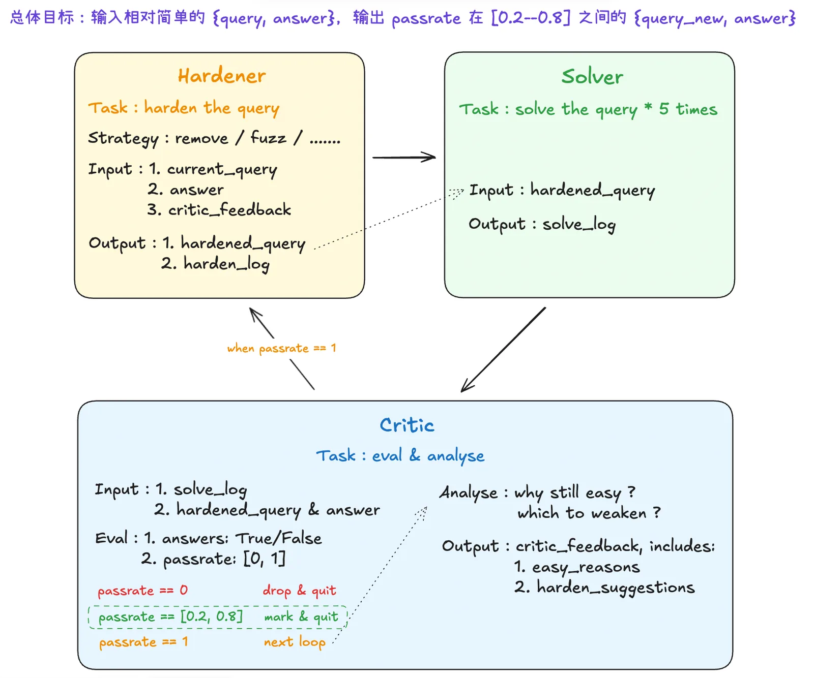

搜索智能体的训练需要难度适中的题——模型不能稳定秒解，但认真搜索仍然可解——只有这样训练才有学习信号。但现有的题往往不够难，强模型通过率很快拉满，训练失去信号。核心矛盾是"形式复杂度"不等于"搜索行为上的真实难度"。我们的方法是用模型真实求解行为来定义难度、用多智能体闭环来增强难度：边解边改，直到题目落入"不能秒解、但认真搜索可解"的目标区间。

先看一道题，感受一下什么叫"看着难但搜起来不难"：

> 有一款 1990 年代中期发布的横版射击平台游戏，后来常被认为是某台老式家用电脑上的技术展示。开发它的工作室只发布过这一款游戏。游戏剧情围绕一个孩子穿过传送门、找回一批"球形玩具"展开；其中一名程序员后来参与过一个著名即时战略系列，而这款游戏的发行商名称又和该系列某个第一人称射击衍生作的副标题相同。问这款游戏叫什么？
>
> 答案：Ruff 'n' Tumble

这道题看起来绕了好几层关系，但强搜索模型只需要把"1990s side-scrolling shooter + Amiga + one game studio"拼在一起，答案就出现在前几条结果里。题面的复杂度没有转化成搜索行为上的真实挑战——这正是我们要解决的问题。

完整的数据生产链路是这样的：先有题目（比如从种子实体出发、在知识图谱上采样多跳路径，再转写成类似 BrowseComp 的间接描述式问题），再用本文介绍的多智能体闭环增强难度，最终产出的高难度题目进入强化学习训练来提升搜索智能体能力。本文聚焦中间的难度增强环节——上游合成的题目虽然形式上模仿了 BrowseComp 的间接描述风格，但对强模型来说仍然太容易，需要进一步把"长得像难题"变成"搜起来真的难"。

## 搜索智能体需要什么样的训练数据

搜索智能体训练的不是"知道答案"这件事，而是搜索行为本身：规划搜索路径、执行查询、阅读网页、验证候选答案。这意味着训练数据必须满足一个条件——模型不能稳定秒解，但认真搜索仍然可解。只有在这个区间里，搜索行为的规划、执行、阅读、验证能力才有学习空间。

现状是，合成的多跳问答题形式上涉及多个实体、多步推理，但强搜索模型并不需要认真规划路径——只要把题面里两三个高信息量词拼起来，答案就会出现在搜索结果前几条里。模型已经能稳定答对的题，对训练没有增益，通过率很快拉到接近 1.0，之后不再有有效的学习信号。

核心矛盾很明确："形式复杂度"≠"搜索行为上的真实难度"。题面写得再复杂，只要模型能直达答案，就没有训练价值。

所以我们需要一种方法，把"看着难"的题变成"搜起来真的难"——在不改变答案的前提下，削弱题面里的低成本搜索路径。

## 什么样的题才算真的难

如果把一道搜索题想成一场捉迷藏，答案就是藏起来的人，题面就是留给寻找者的线索，搜索模型则是那个负责找人的人。我们要设计的不是"谁也找不到"的游戏，而是一个合理的寻找过程：不能一抬头就看到答案，也不能把所有线索都擦掉。

这件事最容易踩的坑，是把"藏起来"理解成单纯加难。实际上有三种完全不同的状态：

| 状态 | 像什么 | 在题目里的表现 | 对训练的价值 |
| --- | --- | --- | --- |
| 藏得太浅 | 人站在门口，衣角露在外面 | 题面里有精确标题、完整人名、明确年份、罕见短语，模型拼几个词就能搜到答案 | 太简单，训练增益低 |
| 藏坏了 | 人进了黑房间，线索全没了 | 关键约束被删掉，答案不唯一，或者公开网页上无法稳定验证 | 风险高，不能直接进训练 |
| 刚好难 | 看不到人，但能沿痕迹找 | 直达题目被挡住，但仍能先找中间实体，再排除候选、交叉验证 | 最适合训练搜索智能体 |

  <strong class="article-inline-panel__title">我们真正想要的难度区间</strong>
  

    

      <b>太简单</b> 
      通过率 = 1.0 
      5 次全对，继续改
    

    

      <b>刚好难</b> 
      0.2 <= 通过率 <= 0.8 
      有时答对、有时走偏，保留
    

    

      <b>太难或改坏</b> 
      通过率 = 0 
      5 次全错，丢弃或复核
    

  

所以，"难"不等于题面更长，也不等于把话说得更绕。

题面写得再复杂，只要里面还露着一块足够显眼的衣角，模型就能直接找到人；题面写得再隐晦，如果已经没有任何可追踪的痕迹，也只是把游戏破坏了。

我们真正要调的是这两者之间的距离：削弱低成本搜索路径，但保留可追踪、可验证、答案唯一的线索链。

这也是为什么我们后来不再只看题面，而是看模型真实"找人"的结果。同一道题让同一个搜索智能体独立解多次：如果每次都答对，说明藏得太浅；如果一次都答不出来，可能是藏得太深，也可能是线索链断了；如果有时能找到、有时会走偏，这类题反而最接近我们想要的训练样本。

后面所有方法其实都围绕这个目标展开：不是把题写得更复杂，而是在保持答案不变的前提下，把"直接看见答案"的题改成"必须按线索找到答案"的题。

## 一开始两条路为什么没走通

知道目标之后，我们先试了两条最直接的路：既然题面里有太多明显线索，那就删掉或者改模糊一点；如果一轮不够，就让模型继续自我改写。

| 尝试 | 做法 | 为什么失败 |
| --- | --- | --- |
| 只靠提示词模糊化 | 删除多余描述，弱化具体日期、地点、名称，用替代表达替换直接实体 | 题面看起来更隐蔽，但模型经常只是把一个强锚点换成另一个强锚点。删掉完整标题后，可能还留下罕见短语；模糊年份后，可能还保留唯一机构名 |
| 多轮自我改写 | 让模型反复检查题面，继续删除直接线索、模糊实体、让约束更独立 | 题面会越来越不像原题，但模型不知道什么时候该停。后几轮容易删掉关键约束，破坏答案唯一性，或者让题面只剩下一串很难落地搜索的描述 |

这两条路最后都卡在同一个地方：改写模型不能只靠自己的感觉判断题有没有变难。它能改写线索，但不知道这些线索在真实搜索里会不会直接命中；它能删掉信息，但不知道删完以后答案是否还唯一；它能把题写得更像难题，但不知道强模型真正解起来会不会仍然很轻松。

所以我们需要把"寻找者"放进流程里。题改完之后，不能只让改写模型自己说"这次藏好了"，而是要真的让搜索智能体去找几次，看它怎么搜、在哪里命中、为什么走偏、最终能不能答对。只有这样，我们才能区分三种情况：题还是太浅，题被改坏了，或者题刚好落在可训练的中间难度。

## 跑通的方法：多智能体边解边改

最后跑通的不是某一个更复杂的提示词，而是让几个智能体分工协作：先改一版题目，再让模型真实解 5 次，根据解题结果决定保留、丢弃，还是继续改。这个方法本身是通用的，不绑定具体题型——任何需要增强搜索难度的题目都可以接入同样的闭环。

三个模块的分工：

- Hardener 负责在答案不变的前提下定向改写题目；
- Solver 负责对改写后的题目采样真实求解轨迹；
- Critic 不只是判对错，还要把求解轨迹转成通过率、决策和下一轮改写建议。

流程图：

| 模块 | 输入 | 输出 | 真正负责的事 |
| --- | --- | --- | --- |
| Hardener | `current_query`、固定的 `answer`、上一轮 Critic 给出的 `easy_reasons` 和 `harden_suggestions` | `hardened_query`、`harden_log` | 不是生成新题，而是针对 Critic 指出的低成本路径做定向改写：删掉直达约束、把直达约束改深一层、模糊时间地点实体，必要时补充不直达的新约束 |
| Solver | `hardened_query` | `solve_log * 5` | 不负责判断题好不好，只是用同一个强搜索模型独立解 5 次，采样真实搜索轨迹和最终回答 |
| Critic | `solve_log * 5`、`hardened_query`、固定的 `answer` | `eval_log`、`passrate`、`decision`，如果需要继续改写再输出 `critic_feedback` | 先判断 5 次回答是否正确并计算通过率，再决定 DROPPED / ACCEPTED / REWRITE；只有需要 REWRITE 时，才分析为什么容易并生成下一轮改写建议 |

第一轮的 `current_query` 是原始题目，后续每一轮的 `current_query` 都是上一轮产出的 `hardened_query`；`answer` 在整个循环里保持不变。只有当 Critic 判定需要 REWRITE 时，上一轮的 `easy_reasons` 和 `harden_suggestions` 才会继续传给 Hardener。

如果继续用捉迷藏的比喻，Hardener 不是"再设计一个新游戏"，而是在同一个答案上重新布置线索。

它拿到的不是空白题面，而是当前题目、固定答案，以及上一轮 Critic 指出的简单原因。比如 Critic 发现某个关键词在搜索前几条结果里直接暴露答案，Hardener 下一轮就会优先处理这个关键词：删掉它、换成更间接的关系描述，或者把精确时间地点做模糊化。目标是让题面从"直接报位置"，变成"需要按线索找"。

这里最关键的约束是答案不变性，也就是答案必须保持不变。整个循环里，`answer` 来自原始题目，不跟着改写变化。Hardener 可以移动线索、模糊线索、减少线索，也可以在不直达答案的前提下补充约束，但不能改变答案类型，不能改变题目问的对象，也不能删掉保证唯一性的核心约束。否则题确实可能变难，但已经不再是同一道题了。

Solver 是真正进房间找人的人。它拿到 Hardener 改完的题目后，用搜索和网页打开工具独立解题，并留下完整 `solve_log`。我们没有只跑一次，因为搜索任务本身有随机性：同一个模型面对同一道题，第一次可能搜到正确中间实体，第二次可能被相似候选带偏，第三次可能因为搜索词写得不一样而走到另一条路径。单次成功或失败都太偶然，所以我们固定让 Solver 对同一道题跑 5 次。

这 5 次 `solve_log` 会被送给 Critic。Critic 第一件事是评估最终答案：每次最终回答是否和标准答案匹配。5 次里答对几次，就得到这道题当前的通过率。这个指标比"题面看起来难不难"更有用，因为它直接来自模型真实解题行为。

我们最关心的不是通过率越低越好，而是中间区间。如果 5 次全对，说明答案仍然藏得太浅，模型已经能稳定找到；如果 5 次全错，说明题可能真的太难，也可能是难度增强过程中把线索链弄断了，这类样本直接进入训练反而风险很高；如果 5 次里有 1 到 4 次答对，说明题仍然可解，但模型还不稳定，这正是训练搜索能力最需要的区域。

如果通过率 = 1.0，Critic 还要诊断为什么这道题仍然容易。它会看 Solver 的搜索轨迹：模型用了什么题目，哪些网页让它很快定位答案，是否有某个短语、年份、机构名或关系描述形成了直达路径。

然后，Critic 会把这些原因整理成 `easy_reasons`，再给出对应的 `harden_suggestions`。下一轮 Hardener 不是盲目继续删词，而是按这些建议做修改，处理真实暴露出来的捷径。

这个闭环解决了前两种失败方法的核心问题。只靠提示词模糊化时，我们不知道改写是否真的挡住了搜索捷径；多轮自我改写时，我们不知道什么时候该停。引入 Solver 和 Critic 之后，是否继续改不再取决于改写模型自己的感觉，而取决于搜索智能体真实找了几次、找得是否稳定、又是沿着哪条路径找到的。

也就是说，我们最后得到的不是一个"更会写难题"的提示词，而是一套可以持续增强难度的数据生产流程。Hardener 负责产生下一版候选题目，Solver 负责产生真实解题轨迹，Critic 负责把轨迹转成接受、丢弃或继续改写的决策，并在继续改写时给出具体反馈。

## 实践场景：让仿 BrowseComp 合成题真正变难

上面描述的多智能体闭环是通用方法，具体实践中我们用它来增强一批仿 BrowseComp 风格的合成题。

BrowseComp 是 OpenAI 在 2025 年发布的搜索能力基准。它的题目由人工编写，极难，核心特征是：目标实体从不直接出现在题面里，而是通过多个交织的间接约束来描述，模型必须把线索拆开、一步步搜索阅读验证，才有机会答对。

我们的上游合成流程模仿了这种间接描述风格：从种子实体出发，在知识图谱上采样一条多跳路径，得到一条事实链，再把事实链转写成不直接暴露答案的题目-答案对。这些题**形式上长得像 BrowseComp**——有多跳关系、有间接描述——但对强搜索模型来说仍然太容易，因为题面里残留的高信息量线索足以让模型直达答案。

难度增强要做的，就是把这些"长得像难题但搜起来不难"的合成题，推到真正需要多步搜索才能解出的难度。

  <strong class="article-inline-panel__title">难度增强在数据流程中的位置</strong>
  

    
种子实体

    →
    
采样路径 构造事实链

    →
    
转写成间接描述式 题目-答案对

    →
    
<b>难度增强与筛选</b> Hardener-Solver-Critic

    →
    
高难度题目 用于训练

  

下面用一个具体例子说明闭环如何逐步把题目推到目标难度。

### 一个具体例子：两轮之后刚好藏住

下面这个例子更能说明闭环的作用。原题问的是一名游泳运动员：

> A swimmer born in 2002, representing an Asian island nation, set a new national record in 2024 that broke a benchmark which had stood for 18 years. This athlete achieved the feat while training abroad as a beneficiary of a global scholarship programme, residing in a European city known for housing the largest synagogue on the continent. What is the name of this athlete?
>
> 答案：Ramudi Samarakoon

这道题看起来已经有一些间接描述，但对强搜索模型来说仍然不难。`swimmer`、`born in 2002`、`Asian island nation`、`national record in 2024`、`18 years`、`global scholarship programme`、`largest synagogue on the continent` 这些线索叠在一起，搜索空间会被迅速压到很小。

| 阶段 | 题目变化 | Solver / Critic 反馈 |
| --- | --- | --- |
| 原题 | 给出出生年份、亚洲岛国、2024 national record、18 年、global scholarship、欧洲最大犹太会堂城市 | 强锚点太多，模型可以用"国家 + 项目 + 年份 + 奖学金 + 训练城市"组合搜索 |
| 第一轮 | `A competitor from an island nation in South Asia, sustained by a global scholarship while living in a major city on the Danube...` | 通过率仍为 1.0。`South Asian island nation`、`city on the Danube`、`2006`、`global scholarship + aquatic` 仍然是强定位点 |
| 第二轮 | `Living in a city of thermal springs on a world body's dime, a competitor from the Indian Ocean finally refreshed a home-country aquatic mark...` | 通过率降到 0.6。直达入口被弱化，但仍能通过"印度洋运动员 + 水上项目纪录 + 国际组织资助 + 温泉城市训练"找到答案 |

第二轮不是把题写得更长，而是把几个直达锚点换成了更需要推理的描述：

| 原来的锚点 | 第二轮写法 |
| --- | --- |
| `city on the Danube` | `city of thermal springs` |
| `global scholarship` | `on a world body's dime` |
| `South Asian island nation` | `from the Indian Ocean` |
| `since 2006` | `nearly eighteen years` |

最后接受的不是"最绕的一版"，而是通过率落到中间区间、仍然保留正确搜索路径的一版。

## 实验验证

那么，这个方法批量跑起来之后，到底有没有更稳定地生产可用数据？

我们前后做了五轮策略迭代。这里不展开每一轮的细节，只看最后的第五版策略。第五版的核心思路，是第一轮就尽量打断原题里的百科式检索路径，把"时间、实体、事实"这条直指信息轴，改写成更依赖关系、间接描述和多条件交集的线索链。

实验设置是 200 条题目，最大迭代轮数为 10，判断规则仍然是：通过率=1 继续改写，0.2 到 0.8 接受，通过率=0 丢弃。

最终第五版策略的主要结果如下：

| 指标 | 结果 |
| --- | ---: |
| 题目数 | 200 |
| ACCEPTED | 124 / 62.0% |
| REWRITE | 10 / 5.0% |
| DROPPED | 66 / 33.0% |
| ACCEPTED 平均通过率 | 0.59 |
| 总迭代次数 | 704 |
| 平均迭代次数 | 3.52 |
| ACCEPTED 平均迭代次数 | 3.23 |

这组结果里有几件事比较关键。

- `REWRITE` 只剩 5.0%。这代表跑到最大轮数后仍然 5/5 全对的题已经很少，说明最终策略确实减少了"看起来改了很多，但模型仍然稳定秒解"的情况。
- 被接受样本的平均通过率是 0.59，正好落在我们想要的中间区间：不是完全不会做，也不是稳定全对。
- 平均每条题目跑 3.52 轮；只看 ACCEPTED 样本，平均 3.23 轮。这个数字意味着每条题目大约需要 3 次改写-求解-评估循环才能落到目标难度区间。

从这组实验里，我们最后得到的判断很直接：

- 首轮就要做结构性变形，尽快切断显式搜索锚点；
- 之后要用 Solver 和 Critic 的执行反馈不断调整，避免题停在"太浅"，也避免滑向"不可解"。

## 和 SAGE 的关系

后来我们也看到了一篇思路很接近的论文：[SAGE: Steerable Agentic Data Generation for Deep Search with Execution Feedback](https://arxiv.org/abs/2601.18202)。

它和我们最后跑通的方向很像：两者都不相信"生成模型自己觉得难"这件事，而是把执行反馈放进数据生成过程。题生成之后，必须真的让搜索智能体去搜、去读、去验证，再用实际表现判断它是太简单、不可解，还是刚好有训练价值。

但任务约束不一样。SAGE 是从给定语料出发，合成新的深度搜索问答，并用目标搜索步数控制难度；我们做的是对上游已经合成出来的题目做保答案的难度增强。

我们的输入不是空白语料，而是一批已有 `{query, answer}`；目标也不是重新发明答案，而是在答案不变的前提下削弱低成本搜索路径。

简单说，SAGE 和我们的共同点是执行反馈；不同点在于：

- SAGE 更偏"从语料里生成深度搜索题"；
- 我们更偏"把已有合成题加工成对强模型有训练价值的高难度题目"。

这篇论文写的还是挺有意思的，感兴趣的话推荐大家读一下～

## 最后留下的经验

这件事做下来，最后沉淀下来的经验很直接：

- 难题不是写出来的，是跑出来的。判断难度不能只看题面，必须看模型真实怎么搜、怎么错、怎么验证。
- 难度增强的底线是答案不变性。我们可以删掉冗余线索、模糊时间地点、把实体改写成关系描述，但不能让答案类型漂移，也不能破坏唯一性。
- 真正要削弱的是低成本搜索路径，而不是盲目减少信息。很多失败样本不是"不够难"，而是"藏坏了"：线索链断掉，候选变多，模型没有可靠方式确认答案。

以上是一套通用的搜索题难度增强方法，核心是用模型真实求解行为替代人工直觉来定义难度。我们在 BrowseComp 风格合成题上验证了它的有效性，但同样的闭环也可以应用于其他需要增强搜索难度的数据生产场景。
