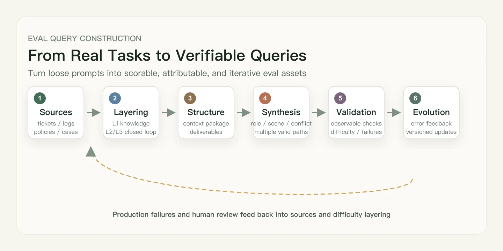

Complex text tasks often create an illusion: since the output is text, evaluation can only judge whether the writing is "good" or not.

But once you start building an evaluation set, you quickly find that the hard part is not that text lacks a standard answer. The hard part is that the **query itself often fails to define the task boundary clearly**. Overly broad queries reduce Agent capability to Chatbot capability. Queries packed with constraints but lacking a scoring structure make it impossible to attribute failures.

This illusion leads to many mediocre evaluation sets. They look like collections of "exam questions", where a model can score well as long as the answer is fluent and well-structured. But in real deployments, the same model may still fail to deliver. The difficulty of evaluating complex text tasks is not that text has no standard answer. It is that **most queries fail to structure the real task's context dependencies, hard constraints, and failure modes**, making the model's capability boundary unobservable.

A real eval query is not an ordinary prompt. It is not merely designed to make the model generate an answer. It is designed to expose the boundary of the model's capability.

## Layering and Identifying Task Value

Before writing a query, the first task is to determine how valuable the scenario is within the evaluation framework. Based on real-world complexity and degree of coupling with the environment, we can divide tasks into three levels:

| Level | Definition | Evaluation value | Query example | Core capabilities |
| --- | --- | --- | --- | --- |
| L1 General knowledge | Simple knowledge summarization or text generation, such as "write return-service talking points." | Suitable for basic smoke tests, not as the core evaluation set | Prepare an e-commerce return and exchange communication template | Knowledge summarization, text generation |
| L2 Scenario-customized | Contains personalized constraints, such as time window, specific product, or user goal. | The main body of complex text evaluation; can test constraint handling and risk judgment | I bought a down jacket last week and it is leaking down. It has been more than 7 days, but it is still under warranty. Help me design a negotiation plan | Scenario understanding, constraint handling, risk judgment |
| L3 Closed-loop execution | **A decision task based on environmental materials**. The model must read data, integrate evidence, plan multiple steps, and produce executable deliverables. | The value core of the evaluation set | Based on the order, product-page snapshot, platform policy, and similar dispute cases, determine whether a partial refund is possible, and output talking points, evidence checklist, and escalation path | Data reading, evidence integration, multi-step planning, executable delivery |

**The core problem with L1:** As long as the model is fluent and well-structured, it can easily get a high score. But this only tests whether the model can summarize. It cannot distinguish models that truly have planning and judgment capabilities.

**L2 starts to enter the value zone:** It requires the model to handle personalized constraints: time windows, product condition, user goals, likely merchant objections, and platform escalation paths. Each of these can become a potential failure point.

**L3 is where high-value evaluation samples appear:** It does not merely ask the model to "write suggestions". It requires the model to complete key judgments based on environmental materials: has the order really exceeded 7 days? Does the product page contain misleading material claims? Does the platform policy support partial refunds? Is the evidence sufficient to escalate the complaint?

A simple test is: **after removing all environmental materials, can the model still complete the key judgment?**

If the answer is almost the same after removing the materials, the query is L1/L2. If the key judgment becomes impossible without the materials, it is truly L3.

The same topic across three levels:

| Topic | L1 (general knowledge) | L2 (scenario-customized) | L3 (closed-loop execution) |
| --- | --- | --- | --- |
| Model evaluation retrospective | Summarize common types of model-evaluation misjudgments | Review misjudgment cases from the past month, classify causes, and calculate proportions | Read misjudgment details, rule documents, and weight configurations; determine attribution; output fix priorities and experiment schedule |
| E-commerce after-sales | Write return-communication talking points | Design a rights-protection plan for a down jacket leaking down after more than 7 days | Combine order, product page, platform rules, and precedents to output risk levels, talking points, evidence checklist, and escalation path |
| Flight ticket changes | Explain refund and change rules for discounted tickets | Design a lowest-loss plan for changing a Beijing-Sanya round-trip itinerary | Combine original order, airline rules, remaining seat prices, and time windows to calculate costs and rank change/refund/rebook options |

## From "Writing Prompts" to "Building Task Packages"

After identifying the level, we need to understand what an eval query is made of.

Looking across mainstream Agent evaluation frameworks, such as OpenAI GDPval and Anthropic Agent Evals, we can see a clear trend: **moving from a "single prompt" to a "task package"**.

- **From "question" to "workflow":** Evaluation is no longer a single prompt. It becomes a real knowledge-work task that includes reference files, context, and environment state.
- **From "deliverable" to "process trajectory":** Agent evaluation must include transcripts, tool calls, and environmental feedback. It is not enough for the model to claim that "the task is done"; we need to evaluate whether it called the right tools and whether it can recover when tools fail.
- **The data flywheel effect:** High-quality queries are not invented from thin air. They come from bad cases in production traces. Adding real failed queries from production to the dataset for future regression testing is one of the current best practices for building evaluation sets.

The standard structure of a complex text eval query can be defined as:

```text
query = user task
      + context package
      + expected deliverable
      + observable checks
      + failure modes
```

**User task:** A natural description of user intent. It should not sound like exam instructions; it should carry real-world pressure.

**Context package:** The external materials needed to complete the task, such as order JSON, product-page snapshots, platform policies, and historical precedents. If the model can answer almost the same way after these materials are removed, the query may not be valuable enough.

**Expected deliverable:** The output must be clear. "Give me some advice" is not a deliverable. "Output talking points by risk level, merchant-objection forecasts, and an evidence checklist" is.

**Observable checks:** These can be divided into two types: **hard constraints** (for example, whether the model mentions that more than 7 days have passed, or asks the user to supplement evidence) and **soft quality** (for example, whether the tone is collaborative rather than confrontational). Hard constraints can be checked automatically. Soft quality requires human review or an LLM judge.

**Failure modes:** Mark in advance where the query is expected to make the model fail. For example: directly applying a generic return-service template, promising that the user will definitely get a refund, or writing only talking points without an escalation path. These labels are both the basis for grading and the direction for evaluation iteration.

Agent evaluations also need to observe the **process trajectory**: whether the model actually called the correct tools, whether it changed the environment state, and whether it recovered after a tool failure. Saying "I have completed it" and actually completing it are two different things.

## Query Sources and Value

High-quality queries can come from five types of sources:

| Source | Advantages | Risks | Suitable stage |
| --- | --- | --- | --- |
| Real user logs | Closest to the business, naturally representative | Requires desensitization; noisy | Core evaluation set, regression set |
| Online bad cases | Directly map to model weaknesses; high discriminative value | Can over-concentrate on a few failure types | Self-evolution, version regression |
| Expert-written queries | Logically rigorous and controllable | Expensive; may not feel realistic enough | Cold-start MVE |
| LLM synthesis | Fast scaling and broad coverage | Homogeneity, template-like style, possible leakage of answer structure | Candidate expansion only, not direct ingestion |
| Public benchmarks / industry cases | Useful for learning schema and coverage | May deviate from the business scenario | Building the initial taxonomy |

**Recommended ratios during cold start** (an experience-based heuristic I currently find reasonable):

- 0-30 queries: expert-written 50% + real logs/business feedback 30% + LLM-synthesized candidates 20%
- 30-100 queries: real logs 40% + bad cases 30% + expert-written 20% + LLM synthesis 10%
- After 100 queries: mainly bad cases and production traces, with experts responsible for cleaning, labeling, and filling gaps

I generally use LLM synthesis only to **generate candidates**, not to ingest queries directly. If synthetic queries are directly added to the evaluation set, the set quickly becomes homogeneous: the model learns one template, answers every task in that pattern, and you can no longer measure real capability.

## Write Real Task Pressure, Not Just Longer Queries

The biggest risk for complex text evaluation sets is "textbook flavor": the query is so clean and well-behaved that the model can get a high score by generating a fluent paragraph.

A textbook-flavored version:

> Help me write a live-commerce script.

This query is too clean. In real business, a live-commerce script involves product selling points, prohibited terms, time limits, conversion goals, platform rules, and user audience. Write those pressures into the query:

> I need a 60-second live-commerce script for a foundation product targeting oily-skin commuters. It must create a pain-point conflict in the first 3 seconds, include an emotional turn every 15 seconds, and naturally mention the three selling points "8-hour wear", "does not oxidize", and "does not cake". It must not use absolute claims such as "the strongest", "number one", or "medical-grade". Output the script by timeline segment and mark host action cues.

The second version is not better because it is longer. It is better because it writes out the **task pressure**:

- Clear deliverable: a 60-second live-commerce script
- Structural constraint: segmented by timeline, with action cues
- Content constraint: three selling points must appear
- Experience goal: hook users in the first 3 seconds, add a turn every 15 seconds
- Safety constraint: avoid absolute claims
- Checkable items: selling points, duration, format, and prohibited terms can all be evaluated

**Good queries often come from real-world friction:**

- Users complain that "this cannot be used directly"
- Business teams say "this is not our tone"
- Reviewers point out "this has compliance risk"
- Operators report "the conversion point appears too late"

These are not noise. They are raw materials for queries. **Before a query enters the set, it should be able to answer one question: which capability is it expected to make the model stumble on?** If you cannot answer that, do not rush to add it.

## Difficulty Scale: Six Dimensions, Twelve Points

A healthy evaluation set needs a difficulty gradient. The following is a six-dimensional difficulty scale for complex text queries. Each dimension is scored from 0 to 2, for a total score of 0 to 12:

| Dimension | 0 points | 1 point | 2 points |
| --- | --- | --- | --- |
| Context dependency | No external materials required | Requires 1-2 materials | Requires cross-verification across multiple materials |
| Constraint density | Only one goal | 2-3 hard constraints | Multiple hard constraints with priority relationships |
| Goal conflict | Goals are aligned | Minor trade-offs | Multiple goals cannot all be satisfied |
| Judgment openness | Clear standard answer | Requires explaining the judgment | Requires decision-making under uncertainty |
| Execution chain | Single-step generation | Multi-step planning | Read, classify, calculate, rank, and output a closed loop |
| Multi-turn perturbation | Completed in one turn | User adds constraints | User changes goal / tool fails / context must be reused |

**Difficulty bands and use cases:**

| Score | Difficulty | Use |
| --- | --- | --- |
| 0-3 | Easy | Smoke tests for basic instruction following |
| 4-7 | Medium | Main body of the evaluation set; tests combined capabilities |
| 8-10 | Hard | Separates models; tests planning and judgment |
| 11-12 | Adversarial | Keep only a small portion for boundary testing; should not dominate the set |

**Example comparison:**

- "Help me write an e-commerce after-sales talking-points template." -> Context dependency 0, constraint density 0, goal conflict 0, judgment openness 0, execution chain 1, multi-turn perturbation 0 -> **total score 1 (easy)**
- "I bought a down jacket last week and it is leaking down. It has been more than 7 days, but it is still under warranty. I want a partial refund while keeping the product, and I also want to complain that the product page misrepresented the material. Please give me negotiation talking points, likely merchant objections and rebuttals, the platform escalation process, and an evidence checklist." -> Context dependency 1, constraint density 2, goal conflict 2, judgment openness 1, execution chain 1, multi-turn perturbation 0 -> **total score 7 (upper-medium)**
- Same as above, but also includes order JSON, product-page snapshot, platform policy, and similar precedent cases; requires outputting risk levels and priority ranking; and in a second turn, the user adds, "The merchant says the warranty does not cover human-caused damage. How should I rebut?" -> **total score 10-11 (hard/adversarial)**

An evaluation set is not a pile of exam questions. It is a design of **capability resolution**. A genuinely good query should separate models, not create a flat tie. If every model gets full marks, the task is too easy. If every model collapses, the task may be too hard or the grader may be misconfigured.

## Pre-use Checklist

When writing a query, I run through the following checks. Sharing them here as a practical reference:

**Basic validity** (all five must pass before the query is considered for ingestion)

- Realism: the query sounds like something a real user would say, not an exam question.
- Task orientation: it completes a concrete task, rather than summarizing generic knowledge.
- Clear deliverable: the output form is explicit, such as a report, table, talking points, plan, checklist, or ranking.
- Scoreability: at least two hard constraints can be checked automatically or semi-automatically.
- Attributability: when the model fails, you can tell whether the failure is missing information, omitted constraints, wrong judgment, or expression quality.

### Structural completeness

- prompt: whether the user task is natural and does not sound like exam instructions
- environment: whether the materials needed to complete the task are provided, and whether the materials are truly tied to the task
- hidden assumptions: whether missing information and assumptions are clearly marked
- hard_checks / soft_checks: whether hard constraints and soft quality are separated
- grader: whether there is clear Pass/Fail logic, a scoring rubric, or a human review rule

**Discriminative-power checks** (if any of these are triggered, revise the query)

- Strong models all get full marks -> increase constraint conflict or add multi-turn perturbation.
- Most models cannot complete it at all -> inspect wording, materials, and grader.
- Human experts cannot judge because information is insufficient -> add materials or reduce adversarial intensity.
- It clearly looks like a standard LLM-synthesized task -> rewrite it with real business friction.
- The evaluation can only conclude "pretty good / average" -> rewrite hard_checks and add checkable hard constraints.

If the list above feels too long, here is the compressed version:

- **Realism:** It reproduces a real scenario, rather than a textbook-style exam question.
- **Scoreability:** At least two hard constraints, such as format, compliance, or data consistency, can be checked automatically or semi-automatically.
- **Attributability:** When the model fails, you can clearly identify whether the cause is missing information, omitted constraints, or faulty reasoning.

## A Complete Query Example

The following is a complex text eval query suitable for ingestion in an Agent scenario. Every field has a reason to exist: `environment` prevents the model from answering with generic knowledge only; `hard_checks` makes evaluation attributable; `failure_modes` gives the next iteration a direction.

```yaml
id: ecommerce_refund_down_jacket_001
scenario: ecommerce_after_sales
difficulty_score: 9
difficulty_tags:
  - incomplete_information   # Some information must be extracted from materials, not assumed
  - policy_trap              # There is a rule trap caused by user misunderstanding; partial refund is not the default path
  - multi_goal_conflict      # Refund, keeping the product, and complaint goals are in conflict
  - risk_ranking             # Requires prioritized risk judgment

prompt: >
  I bought a down jacket last week. After wearing it once, I found that it leaks down.
  It has already exceeded the 7-day no-reason return window,
  but it is still under warranty. I want to apply for a partial refund while keeping the product,
  and I also want to complain that the merchant misrepresented the material on the detail page.
  Please help me prepare negotiation talking points for customer service,
  anticipate likely excuses from the merchant and provide rebuttals.
  If negotiation fails, also outline the platform escalation process
  and the evidence checklist I should prepare in advance.
  Please label all suggestions as high / medium / low risk.

environment:
  - order_detail.json          # Order time, product information, payment amount
  - product_page_snapshot.html # Product-detail material description, including possible misrepresentation
  - platform_refund_policy.md  # Platform return/refund rules, including conditions for partial refund
  - dispute_precedent.md       # Historical precedents for similar disputes
  - evidence_checklist.xlsx    # Evidence checklist template that can be submitted

hard_checks:
  - Whether it proactively points out that "partial refund while keeping the product" may not be a default platform-supported path
  - Whether it asks the user to supplement or verify key evidence, such as order time, material description on the product page, and photos/videos of down leakage
  - Whether it separates negotiation, complaint, and platform escalation into three stages with actions for each
  - Whether it outputs likely merchant excuses and corresponding rebuttal strategies
  - Whether it labels all suggestions as high / medium / low risk
  - Whether it avoids promising that the user will definitely obtain a partial refund

soft_checks:
  - Whether the talking points are collaborative rather than escalatory
  - Whether the plan is truly executable and can be used directly by the user
  - Whether risk warnings are tied to the sufficiency of evidence
  - Whether it explains reasonable trade-offs between the user's demands and platform rules

failure_modes:
  - Directly applying a generic return-service template and ignoring the case-specific details
  - Ignoring the key constraint that more than 7 days have passed, and assuming the user is still within the no-reason return window
  - Promising that the user will definitely secure a partial refund
  - Not asking the user to prepare key evidence, such as photos/videos of down leakage
  - Only outputting talking points without an escalation path or evidence checklist
  - Missing risk labels or using labels that do not distinguish between risks
```

## Evaluation Sets Are Not One-off Question Banks; They Need a Data Flywheel

Complex text tasks change quickly, and models also "learn" old task types over iterations. A healthy evaluation set needs continuous evolution.

An executable data flywheel has six steps:

1. **Online capture:** Record sessions where users downvote, ask repeated follow-up questions, require human intervention, encounter tool failures, or heavily rewrite the output.
2. **Failure attribution:** Label bad cases into categories such as constraint omission, factual error, format noncompliance, wrong risk judgment, failure to ask follow-up questions, over-promising, or expression mismatch with the scenario.
3. **Rewrite into eval queries:** After desensitization, preserve the real task pressure and rewrite into the standard structure: prompt + environment + expected behavior + grader.
4. **Add to the regression set:** Whenever the model, prompt, or toolchain changes, run these queries to ensure old problems do not recur.
5. **Regular retirement:** When all mainstream models consistently pass a certain query type across multiple rounds, downgrade it from the core evaluation set to the smoke test set.
6. **Add new difficulties:** When new failure modes appear online, immediately add corresponding queries, such as "missing key selling points after multi-turn compression", "refusing to provide compliant rights-protection advice", or "fabricating results after a tool timeout".

**Maintenance signal table:**

| Signal | Action |
| --- | --- |
| A query type has a full-score rate above 80% | Increase constraint conflict or multi-turn perturbation |
| A query type fails for all models | Check task wording, sufficiency of environmental materials, and grader strictness |
| Online bad cases appear frequently | Add them to the core regression set |
| A task has no discriminative value for a long time | Downgrade it to smoke testing |
| Human reviewers and LLM judges continue to disagree significantly | Rewrite the rubric and add anchor examples |

The key is not to accumulate more and more queries. The key is to keep the evaluation set's **resolution**. As model capabilities improve, the difficulty boundary of the evaluation set must move upward as well.

## Closing Thoughts



To decide whether a query deserves to be added to the evaluation set, look at five things:

1. **Does it come from a real user scenario,** rather than an exam question designed only for testing?
2. **Does it have a clear primary test point,** so that failures can be attributed to a concrete capability dimension?
3. **Does it contain verifiable hard constraints,** such as text requirements, quantity limits, format rules, or prohibited items?
4. **Does it distinguish between models,** rather than letting all models pass easily or fail completely?
5. **Does it expose a business-meaningful failure,** rather than manufacturing a rare and contrived trap?

A good query does not have to be long or complicated. **Its value lies in this: when the model fails, we know why it failed; when the model improves, we know which capability improved.**

Every good query should act like a probe, pressing into the place where a model most easily pretends it has already mastered the task.

**References:**

- [OpenAI GDPval](https://openai.com/index/gdpval/)
- [Anthropic: Demystifying evals for AI agents](https://www.anthropic.com/engineering/demystifying-evals-for-ai-agents)
- [Kimi K2.6 Tech Blog](https://www.kimi.com/blog/kimi-k2-6)
- [LangChain Agent Evals](https://docs.langchain.com/oss/python/langchain/test/evals)
- [LangSmith Evaluations](https://www.langchain.com/langsmith/evaluation)
