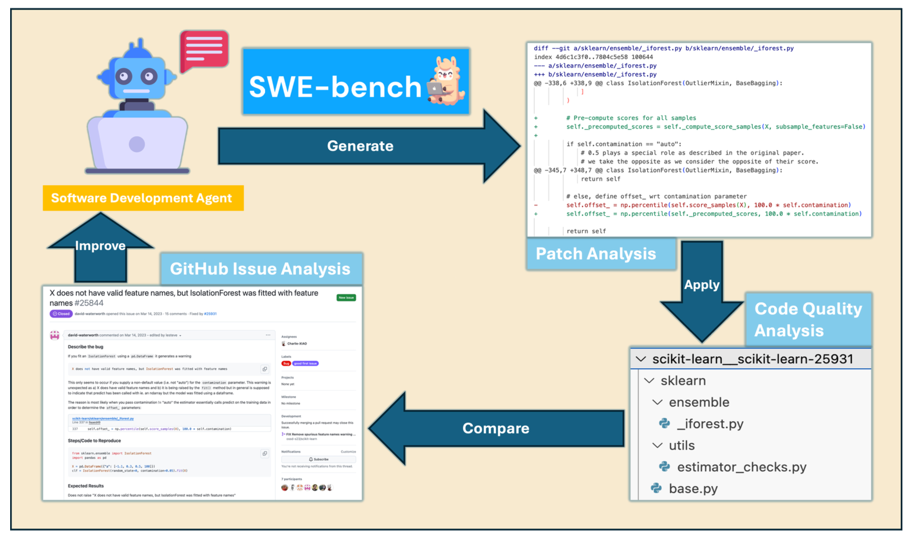
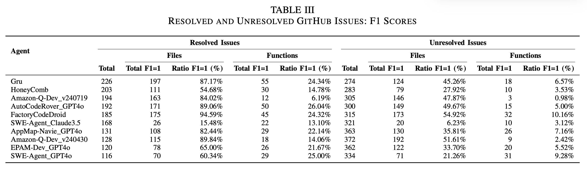
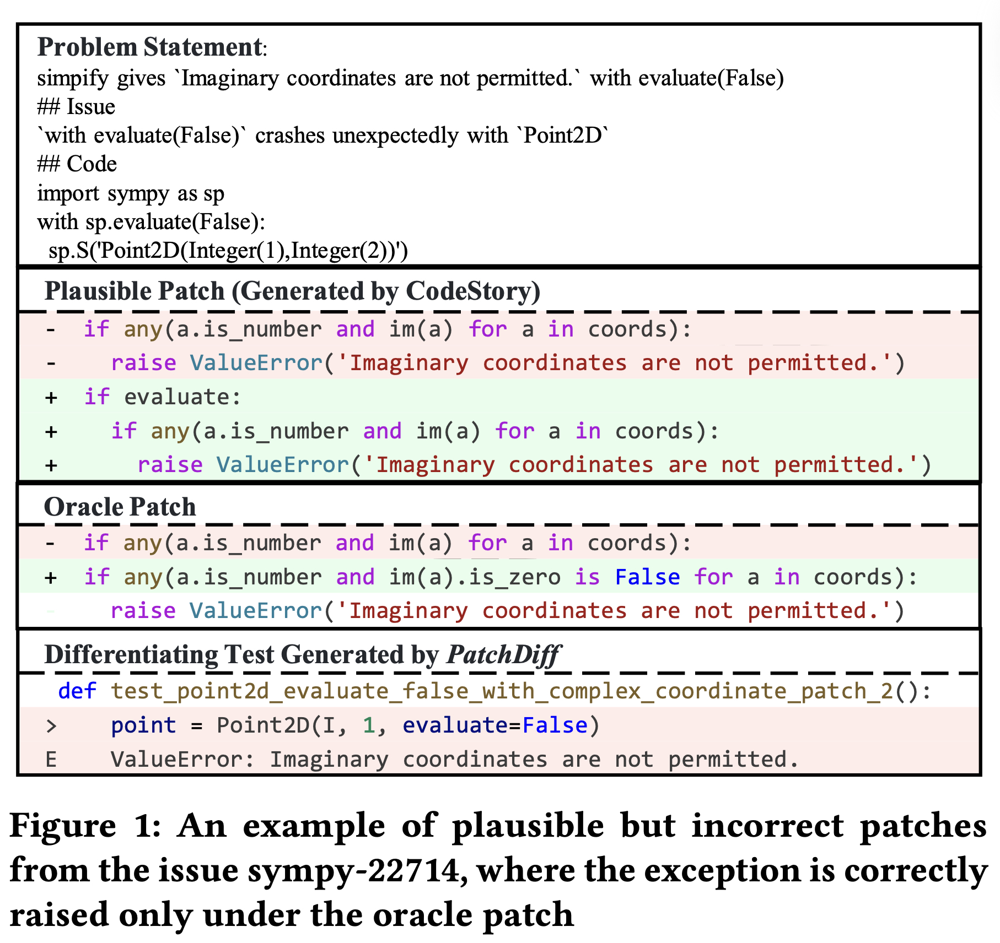
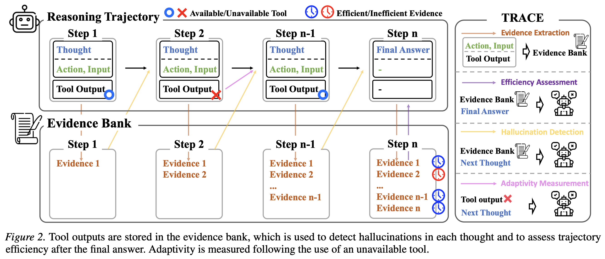
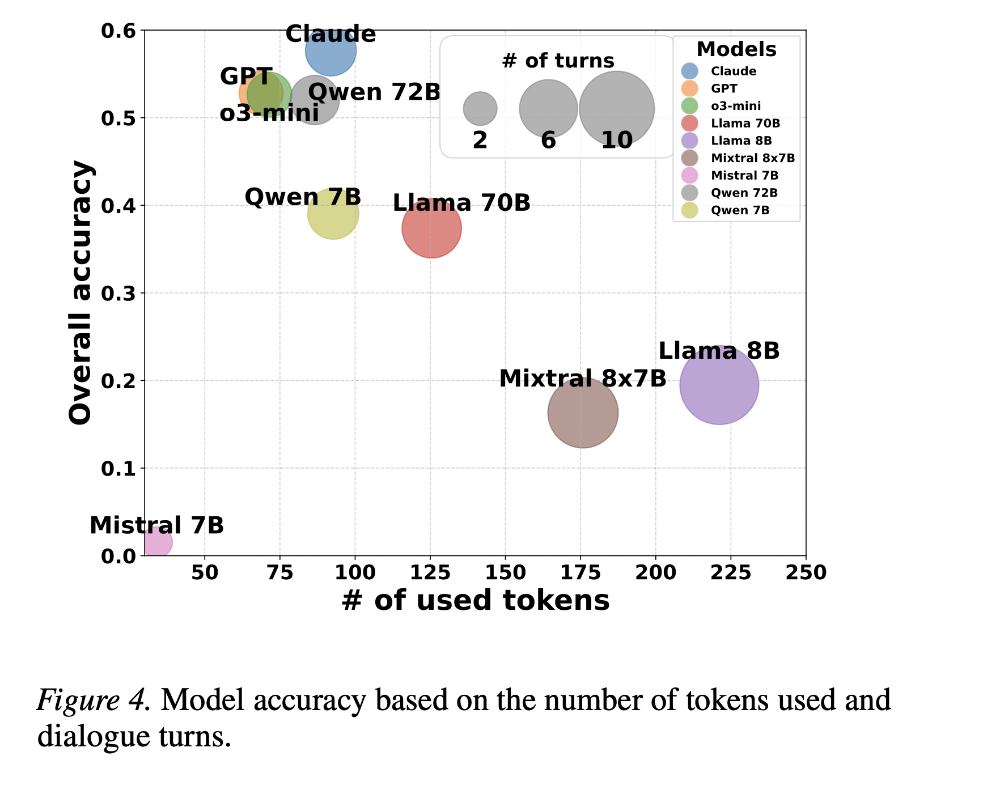
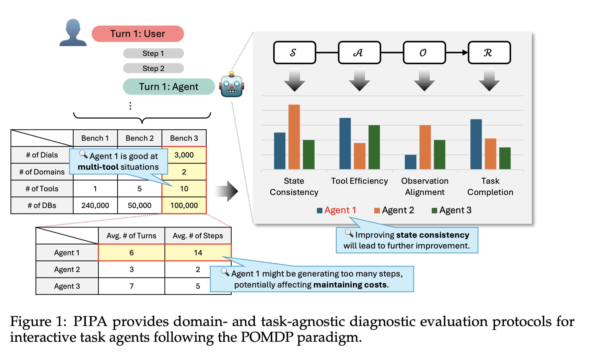
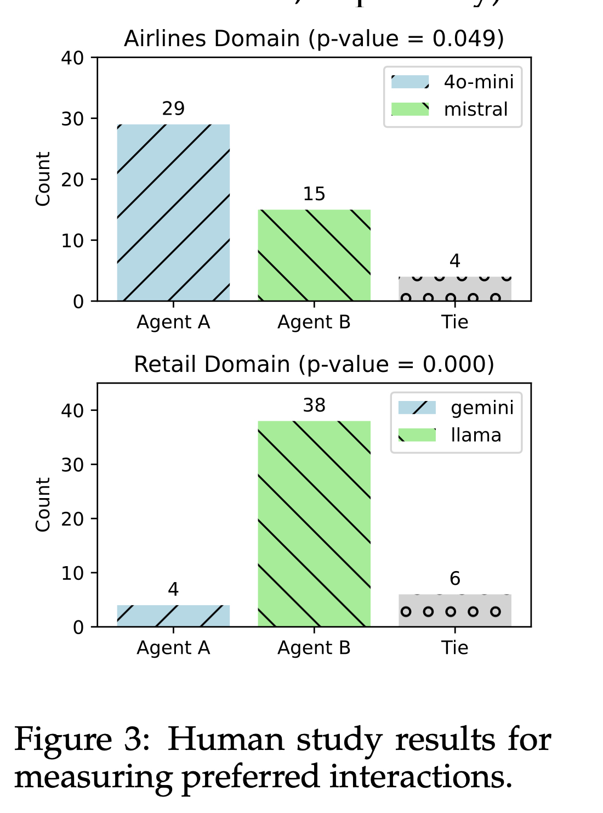

## TL;DR

当前 Coding Agent 评估的主流做法——"测试通过即正确"——存在严重盲区。本文综合解读四篇论文，揭示三个核心问题：

1. **通过测试 ≠ 改对位置**：Agent 经常找对文件但改错函数，函数级 F1 仅 24%
2. **通过测试 ≠ 行为正确**：29.6% 的 "已解决" 补丁与开发者补丁存在行为差异，解决率被虚增 6.4%
3. **答案正确 ≠ 过程可靠**：最终结果相同的 Agent，推理效率、幻觉率和适应性可以天差地别

评估需要从"结果正确"走向"过程可靠"——这是 Beyond F2P 的核心主张。

## 问题意识：为什么 Pass Rate 不够？

SWE-bench 及类似 benchmark 的评估逻辑很简单：给 agent 一个 GitHub issue，让它生成补丁，跑测试——通过就算解决。这个范式有三个根本缺陷：

- **测试覆盖有限**：SWE-bench 只选择了完整测试套件的一小部分，遗漏的场景可能隐藏 regression
- **正确性被过度简化**：补丁可能通过测试但改了不该改的地方，或用了与开发者完全不同的（错误的）策略
- **过程质量被忽略**：同样得到正确答案，一个 agent 2 步完成，另一个 agent 兜兜转转 20 步还产生幻觉——部署时体验天差地别

下面分两条线展开——补丁质量（论文 1-2）和轨迹质量（论文 3-4），逐层揭示 "测试通过" 与 "真正正确" 之间的距离。

---

## Part I: 补丁质量评估

### 论文一：多层次补丁模式分析

> Evaluating Software Development Agents: Patch Patterns, Code Quality, and Issue Complexity in Real-World GitHub Scenarios
> Zhi Chen, Lingxiao Jiang · Singapore Management University · arXiv:2410.12468v2, 2024.12

**数据规模：** SWE-bench Verified（500 issues）× 10 个 agent = 4892 个补丁，以开发者原始提交（Gold Patch）作为参照。


*研究总览——从补丁模式、代码质量、问题复杂度三个维度全面评估 agent 补丁*

#### 怎么评测

论文设计了四层递进的对齐度分析：

| 粒度 | 方法 | 核心发现 |
|------|------|----------|
| Issue 级 | 统计每个 issue 被几个 agent 解决 | 仅 5.8% 的题目被全部 10 个 agent 解决，agent之间呈现出极强的互补性 |
| File 级 | 以 Gold Patch 修改的文件为基准，计算 Precision / Recall / F1 | 最好的 agent 文件级 F1=1 达 87% |
| Function 级 | 以 Gold Patch 修改的函数为基准，计算 Precision / Recall / F1 | **函数级 F1=1 骤降至 24%** |
| Line 级 | 添加行/删除行/净变化 + Wilcoxon 检验 | 部分 agent 净增量显著偏高（过度修改） |

**关键发现：Agent 经常"找对文件，改错函数"。** 文件级对齐度很高（agent 能定位到正确文件），但函数级大幅下降——它改了不同的函数，只是恰好测试覆盖不到那里。这意味着即使测试通过，补丁可能在未来造成 regression。


*文件级 vs 函数级 F1-Score 对比——文件级对齐度高，但函数级大幅下降*

#### 代码质量：会不会写"烂代码"？

用 SonarQube 对补丁应用前后做静态分析（Bugs / Vulnerabilities / Code Smells / Cyclomatic Complexity / Duplication）：

- **安全性**：所有 10 个 agent 零漏洞引入
- **代码异味**：所有 agent 均有效减少（修 bug 时顺带清理）
- **圈复杂度**：多数略增，但效果量极小（r < 0.1），可忽略

整体结论：agent 补丁的代码质量与人类开发者相当。

#### 什么问题解不了？

通过 Mann-Whitney U 检验方法，比较了 Bench 中已解决 vs 未解决问题的特征。

> **名词解释：** 圈复杂度（Cyclomatic Complexity）衡量代码逻辑分支的复杂程度——每多一个 if/for/while 分支就 +1，值越高代码越难理解和测试。p 值是统计检验的结果，表示"两组之间的差异纯属巧合的概率"，p < 0.05 即认为差异是真实存在的（不是随机波动）。

- **显著因素（未解决的问题明显更难）**：
  - 源码行数（p=0.006）：未解决问题涉及的源文件平均更大（中位数 1008 行 vs 已解决的 703 行）
  - 圈复杂度（p=0.006）：未解决问题对应的代码逻辑分支更多（中位数 903 vs 192）
  - Gold Patch 修改行数（p<0.001）：未解决问题需要的修复改动量更大（中位数 24 行 vs 9 行）
- **不显著（对 agent 成败没有影响）**：问题描述的可读性、代码块数量、代码文本比

**结论：决定 agent 成败的是代码本身的复杂度，而非问题描述的质量。** 将复杂问题拆解为子任务可能是提升 agent 表现的有效策略。

---

### 论文二：通过测试 ≠ 真正正确

> Are "Solved Issues" in SWE-bench Really Solved Correctly? An Empirical Study
> You Wang, Michael Pradel, Zhongxin Liu · 浙江大学 / CISPA · ICSE 2026

#### 核心方法：PatchDiff

PatchDiff 的思路很直接：如果生成补丁和开发者补丁行为相同，就不可能存在一个测试让一个通过另一个失败。如果能自动生成这样的"区分性测试"（Differentiating Test），就证明了行为差异。

**五步流程：**

1. **语法去重**：排除与 Oracle Patch 完全相同的补丁
2. **目标函数识别**：通过 call-trace 找到测试直接调用的、被补丁修改影响的入口函数
3. **上下文提取**：为 LLM 准备精简代码上下文（保留目标函数类定义，删除无关代码）
4. **LLM 生成测试**：每个目标函数生成 10 个区分性测试
5. **过滤验证**：运行 20 次排除 flaky test，只保留 Oracle 通过 + 生成补丁失败的

**一个具体例子（sympy-22714）：**

SymPy 的 `Point2D` 在 `evaluate=False` 时应拒绝虚数坐标。Oracle Patch 无论 evaluate 值如何都检查虚数；生成补丁只在 `evaluate=True`（默认值）时检查。SWE-bench 测试只用了默认参数，所以生成补丁通过了。PatchDiff 通过分析代码差异，生成了 `Point2D(1+2*I, 3, evaluate=False)` 这个测试用例，成功暴露了遗漏。


*PatchDiff 示例——Oracle 用 im(a).is_zero 判断，生成补丁仅加了 if evaluate 条件但遗漏了虚数检查*

#### 关键结果

| 发现 | 数据 |
|------|------|
| 开发者完整测试套件就能筛掉的 | 7.8% 的 plausible patches |
| PatchDiff 发现的行为差异 | 29.6% |
| 人工确认为错误的 | 28.6%（抽样） |
| 解决率虚增幅度 | **6.4 个绝对百分点** |

**行为差异的四种模式：**

- Divergent Implementations（46.8%）：不同实现，效果不完全相同
- Supplementary Sem-Change（27.3%）：生成补丁比 Oracle 多处理了一些情况（过度修复）
- No Alignment（20.8%）：两个补丁修改位置/目的完全不同
- Absent Sem-Change（5.2%）：Oracle 有某个语义变更，生成补丁完全缺失

**核心结论：当 agent 声称 "60% 解决率" 时，真实正确率可能只有 53-54%。**

---

## Part II: 轨迹质量评估

### 论文三：TRACE — 推理过程的三维评估

> Beyond the Final Answer: Evaluating the Reasoning Trajectories of Tool-Augmented Agents
> Wonjoong Kim et al. · KAIST / Yonsei University · ICML 2026

#### 核心创新：Evidence Bank

TRACE 的关键设计是 **Evidence Bank (证据库)**：将 agent 每步工具调用的输出记录为客观证据 e_t = (action, input, output)。这些工具返回结果构成评估基础，不需要人工标注的参考轨迹（reference-free）。


*TRACE 框架全景——Evidence Bank 存储每步工具输出，支撑三个维度的独立评估*

#### 三个评估维度

**1. 效率 (Efficiency)**

在 agent 得出正确答案后做后验分析：用 LLM 识别证据库中对最终答案必要的最小子集 ε_min。

```
Efficiency = |ε_min| / |ε_n|
```

值为 1 表示零冗余，0.3 表示 70% 的工具调用是不必要的。

**2. 幻觉 (Hallucination)**

逐步检查 agent 的 thinking：当思考内容包含无法从已有证据库 ε_{t-1} 推导出的声明时，标记为幻觉。

```
Hallucination = Σ H(s_t) / n，H ∈ {0, 1}
```

**3. 适应性 (Adaptivity)**

找到所有工具调用失败的步骤，评估下一步是否承认失败并切换策略：

```
Adaptivity = Σ Adp(s_{t+1}) / |F|
```

#### 关键发现

- **Accuracy 相近的模型，轨迹质量完全不同**——证明过程评估的必要性
- **Token 消耗与准确率负相关**——冗余推理不仅浪费资源，还损害最终表现
- **幻觉率高的模型适应性往往低**——倾向于"硬编"答案而非调整策略


*Token 消耗与准确率关系——更多 token ≠ 更好结果，反而负相关*

---

### 论文四：PIPA — 交互过程的统一诊断

> PIPA: A Unified Evaluation Protocol for Diagnosing Interactive Planning Agents
> Takyoung Kim*, Janvijay Singh* et al. · UIUC · arXiv:2505.01592v1, 2025.05

#### 理论基础：POMDP

PIPA 将交互式 agent 建模为部分可观察马尔可夫决策过程（POMDP）：用户真实意图是隐藏状态，agent 只能通过对话和工具返回间接推断。基于这个范式，对行为的每个组成部分定义评估指标。


*PIPA 将交互式 agent 行为建模为 POMDP——S(状态) → A(动作) → O(观察) → R(奖励)*

#### 五维评估体系

| 指标 | POMDP 要素 | 评估内容 | 粒度 |
|------|-----------|---------|------|
| **S** State Consistency | 信念状态 | agent 内部状态是否正确反映用户需求 | 每步 |
| **A** Tool Efficiency | 动作选择 | 工具调用的成功/失败比 | 每步 |
| **O** Observation Alignment | 观察/输出 | 回复内容是否与需求一致 | 每步 |
| **P** Policy Adherence | 策略约束 | 是否遵守全局规则 | 会话级 |
| **R** Task Completion | 奖励 | 任务是否完成 | 会话级 |

**设计特点：** 每个指标是原子化布尔判断（简单、可复现），领域无关（可跨 benchmark 比较），向后兼容（保留原有 R 指标）。

#### 关键发现

- **Task Completion (R) 与其他维度不相关**：R 高不代表 S/A/O/P 高
- **Human Study 验证**：Task Completion 相同时，用户显著偏好 PIPA 均分更高的对话（p<0.05）
- **Agent 混合实验**：用不同 agent 的不同能力组合，性能优于任何单一 agent——证明诊断性评估可以直接指导优化


*人类偏好研究——当 Task Completion 相同时，用户显著偏好 PIPA 均分更高的对话*

---

## 综合分析与讨论

### 方法论定位对比

| 维度 | 论文 1 | 论文 2 | 论文 3 | 论文 4 |
|------|--------|--------|--------|--------|
| 核心问题 | 补丁结构是否与开发者对齐？ | 通过测试的补丁是否行为正确？ | 推理轨迹是否高效可靠？ | 交互过程是否满足用户预期？ |
| 评估对象 | Patch 结构 + 静态质量 | Patch 功能正确性 | 单次推理轨迹 | 多轮交互对话 |
| 技术路径 | 多层次 F1 + SonarQube | LLM 生成区分性测试 | Evidence Bank + LLM Judge | POMDP 五维分解 |
| 评估粒度 | Issue → File → Function → Line | 函数行为差异 → 四类模式 | 逐步证据验证 → 全局聚合 | 逐步布尔判断 → 维度聚合 |

四项工作从不同切面揭示了同一问题：**单一通过率指标无法充分表征 agent 的实际能力。** 论文 1-2 聚焦补丁产物本身（改了什么、改对没有），论文 3-4 聚焦生成过程（怎么推理、怎么交互）。前者回答"产出物可靠吗"，后者回答"生产过程可控吗"——两者构成评估体系的互补层次。

### 关键启示

1. **评估需要分层设计**：结果正确性（pass rate）、功能正确性（行为对齐）、结构正确性（修改位置）、过程质量（效率/幻觉/适应性）构成四个正交维度，单一指标难以覆盖
2. **测试覆盖是当前瓶颈**：SWE-bench 的测试子集选择导致 6.4% 的解决率虚增，PatchDiff 等测试增强方法是可行的补救方向
3. **Agent 互补性具备工程价值**：仅 5.8% 的问题被全部 agent 解决，但 66% 被至少一个解决——这为 Ensemble 或 Router 策略提供了实证基础
4. **精简推理优于冗余推理**：TRACE 的实验表明 token 消耗与表现负相关，过度推理不仅浪费资源还会引入幻觉

### 局限性

- 论文 1-2 均依赖 SWE-bench 生态，结论向其他基准（Aider、HumanEval 等）的泛化性尚未验证
- PatchDiff 依赖 LLM 生成区分性测试，其自身存在 false negative 风险（无法暴露所有行为差异）
- TRACE 和 PIPA 均采用 LLM-as-judge 方案，评估者本身的一致性和准确性需要更大规模的 meta-evaluation

