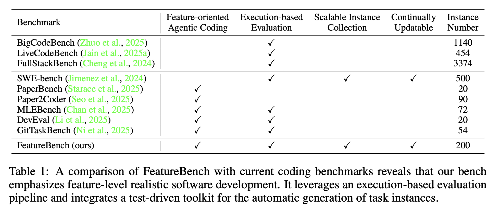
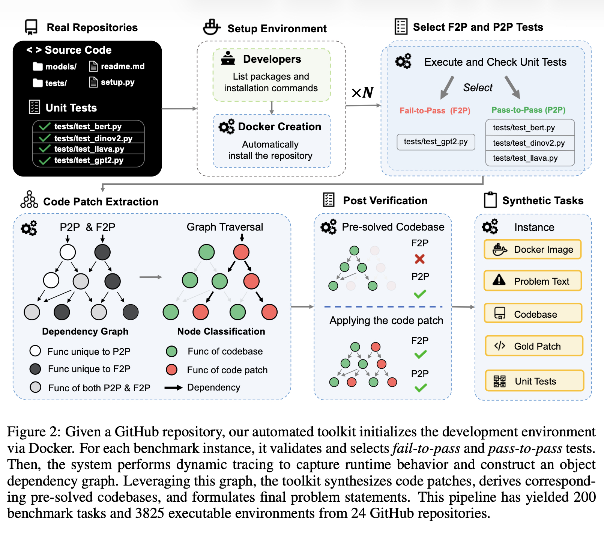
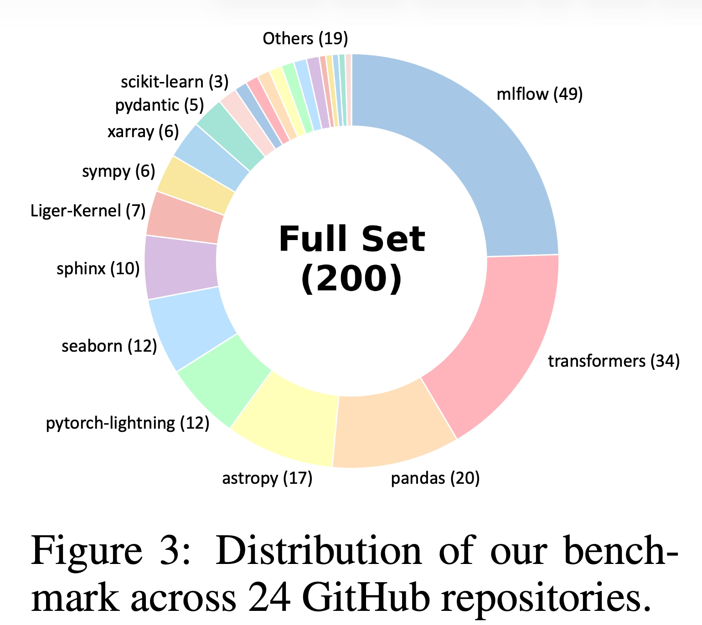
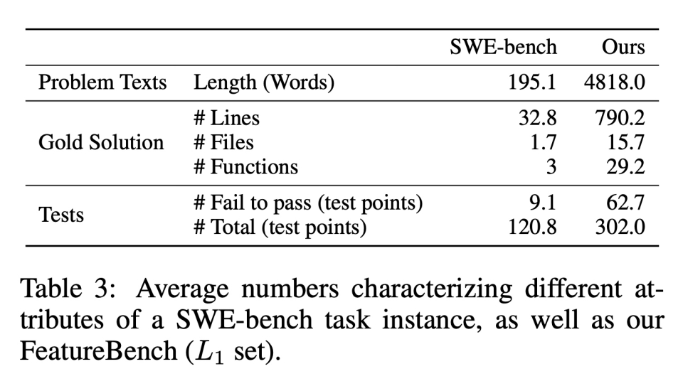
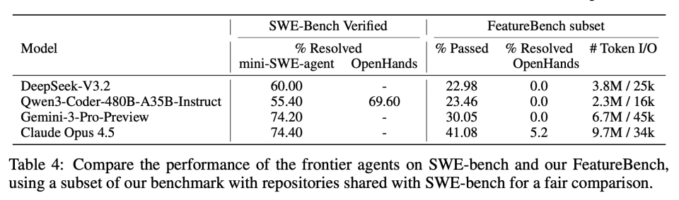
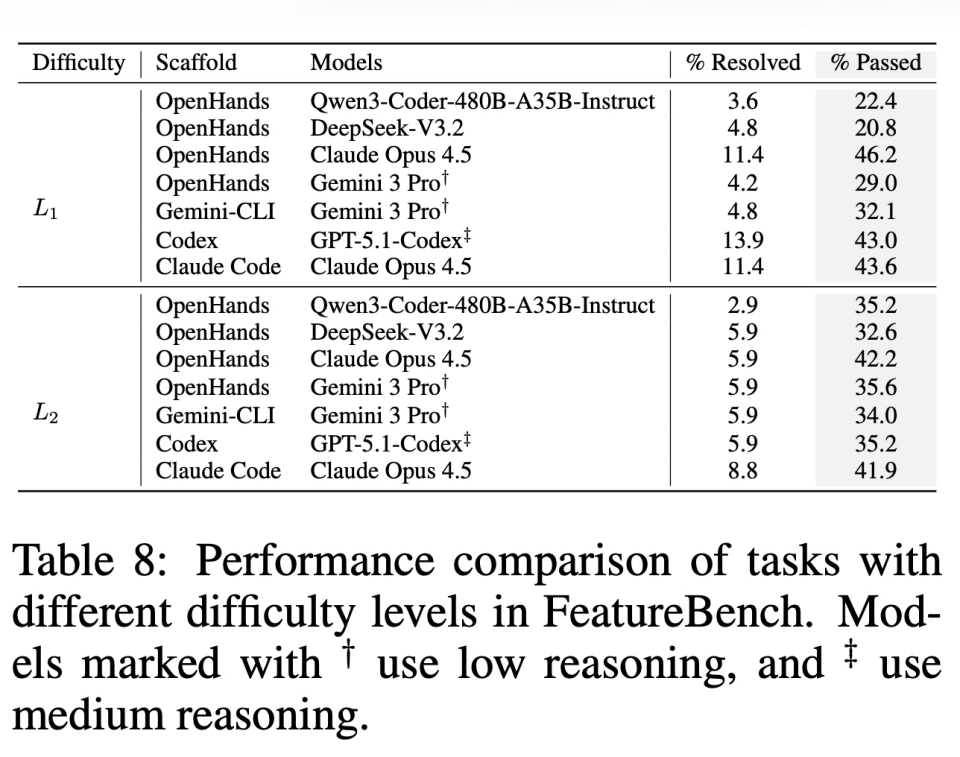
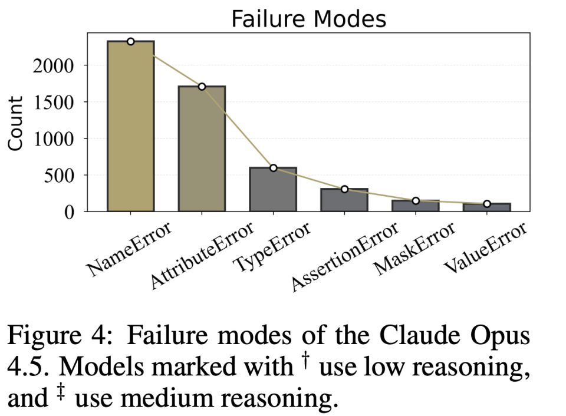
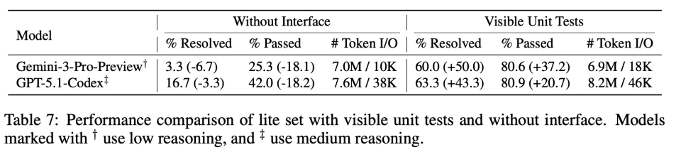

> FeatureBench 面向真实功能开发场景，依托自动化流水线支持可执行评测与持续迭代。实验结果显示，当前 AI 独立开发复杂功能的能力依然薄弱。

## 一、为什么需要FeatureBench？
如今，Code Agent早已不是光标旁单纯补全程式的辅助工具，Claude code，codex等知名agent似乎已经具备了直接投入生产的能力，向端到端自主软件开发演进已是大势所趋。然而在真实的企业开发环境里使用时，却发现模型远没有想象中那么能打——一遇到跨文件修改就掉链子，新功能好不容易堆上去，旧逻辑在不知不觉间又崩了，实在让人头疼。

明明在主流Bench上包揽冠亚军的模型，怎么一上战场就歇菜了？
其实模型没变笨，Bench也没作弊，只是传统评测基准跟真实的业务场景之间，确实有点"水土不服"。

1. **任务场景单一**：以SWE-bench为代表的主流基准，核心任务集中于单PR的Bug修复，功能开发类任务仅占18%–22%，难以覆盖真实的"新增功能"开发需求。
2. **数据采集困难**：传统基准依赖人工从PR/Commit中筛选样本，而真实功能开发常横跨多个Commit和PR，人工关联成本高且易遗漏。
3. **评估方式主观**：部分基准缺乏可执行的自动化测试，依赖人工或LLM主观判断，结果客观性不足。
4. **数据泄露风险**：静态数据集无法动态更新，模型可能在训练中"见过"评测数据，导致分数虚高，无法反映真实能力。

针对上述问题，为更贴近生产实践、有效衡量模型能力边界，**FeatureBench** 应运而生。

## 二、FeatureBench 核心定位与四大核心特性
FeatureBench 是一套由中科院自动化所与华为联合团队打造，针对"从零/基于现有代码新增完整功能"这一真实开发场景的code agent评测基准。
通过对比现有Bench，可以直观看到FeatureBench 是目前少数同时满足**功能导向、自动化执行评测、规模化采集、持续迭代**四大条件的编码基准。

### 1. 聚焦真实功能开发，划分两大难度场景
FeatureBench的所有任务均围绕**新增完整功能**设计，而非修复问题。任务分为两个难度等级，完全模拟两种真实开发模式：

* **L1（增量开发）**：基于现有代码库补充缺失功能，代码上下文完整，是企业最常见的迭代模式；
* **L2（从零开发）**：无任何原有代码，仅根据接口文档独立实现整套功能，难度更高。

每个任务都会提供**清晰的函数接口、调用路径、输入输出规范**，要求模型输出**可直接调用**的代码，从根源避免"实现逻辑和测试用例不匹配"的问题。这也是和SWE-bench最本质的区别。

### 2. 基于单元测试进行功能描述，源头消除实现歧义
传统基准多依赖自然语言描述，缺乏标准化的代码接口定义，容易导致多种合法实现，难以自动化校验；部分基准甚至无可执行测试，只能依靠人工或LLM评判。

FeatureBench 采用测试驱动设计，任务描述直接绑定从源码自动提取的原生接口（明确类名、函数名、参数类型、返回值、文件路径、导入规则等），确保实现规范唯一，评测标准严谨。

### 3. 自动化数据采集流水线，极低人工成本
传统基准依赖人工筛选PR，而FeatureBench 设计了一套**依赖图追踪+单元测试驱动**的全自动采集流程，仅需人工配置仓库安装命令（单个仓库约3分钟），其余步骤全部自动化实现。这套流程摆脱了对人工PR/Commit的依赖，可以从任意Python开源仓库批量生成评测任务，具备极强的扩展性。

### 4. 可持续更新，规避数据泄露
依托自动化采集工具，FeatureBench 可以持续从新的代码仓库、新的代码提交中生成新任务。模型无法"刷题库"，保证长期评测结果的真实性。

## 三、核心技术：基于动态依赖图的全自动任务提取算法
传统基准（如SWE-bench）依托Commit/PR划分任务，但功能开发往往分散于多个PR/Commit，人工关联成本高，且按提交记录切分代码无法区分新功能与公共代码，容易破坏仓库原有逻辑。

FeatureBench提出了一套全自动化流水线的数据构造方法，可以从开源Python仓库中自动剥离未实现的功能代码，同时保留其他所有模块完整性，最终生成合规的评测任务。整套流程仅需人工完成仓库环境配置，其余步骤全部自动化执行，有效提升了数据构造效率。

### step 0：F2P / P2P 测试筛选
依赖图的构建完全依托仓库内的单元测试，通过调用 pytest 工具自动扫描仓库内所有合法测试文件后，仅保留可正常执行、无环境报错的测试用例。

进一步需要区分 F2P、P2P 两类测试集合，规则如下：

1. **F2P（Fail-to-Pass）测试**
指代**针对目标待实现功能**的单元测试。在原始仓库中移除目标功能后，这类测试执行结果为**失败**；当 AI 正确实现对应功能后，测试必须全部通过。在单任务配置中，默认仅选取**1 个 F2P 测试文件**作为核心测试主体。
2. **P2P（Pass-to-Pass）测试**
指代**仓库原有存量功能**的单元测试。无论是否新增目标功能，这类测试都必须持续正常运行、全部通过，用于保证新代码不会破坏项目原有逻辑。流水线会随机筛选 **5 个 P2P 测试文件**作为基准。

### step 1：动态运行时对象依赖图构建（Graph Construction）
FeatureBench **不使用静态语法树或静态依赖分析**，而是采用 **Python 运行时动态追踪** 的方式构建依赖图。

从已筛选的 F2P 测试与 P2P 测试入手，在代码运行过程中，通过 **Python 原生运行时追踪工具** 捕获全程函数调用事件，并基于真实调用关系构建 **有向依赖图**。

图中点与边的定义如下：

- **节点（Node）**：对应仓库中的一个函数或类方法，即代码可执行单元；
- **有向边（Edge）**：从节点 A 指向节点 B，表示 A 在运行过程中调用了 B，反映真实代码调用关系。

每个节点附带完整的属性信息，用于后续节点分类、图遍历及后置校验，包括：

1. 全局唯一节点 ID；
2. 对应代码文件路径与行号；
3. 当前节点的所有下游依赖节点列表（即该节点直接调用的函数/方法）；
4. 布尔标记位，标识该节点是否在 P2P 测试执行过程中被触发调用。

经过上述步骤，最终生成的依赖图就可以完整还原 F2P 目标功能与 P2P 存量功能在运行时的全部函数调用链路及依赖关系。

### step 2：LLM 辅助顶层对象分类（Top Object Classification）

依赖图构建完成后，需要进一步判定图中哪些节点属于"待实现的目标功能"。论文采用 **LLM 分类器 + 人工标注校验** 相结合的方案，针对 F2P 测试中涉及的导入对象，将其划分为两类：

1. **被测试对象（Tested Object）**：即 F2P 测试核心验证的顶层接口/函数/类，也是本次任务需要实现的目标功能入口；
2. **非测试对象**：包括测试辅助工具、通用工具函数、底层公共组件、测试框架依赖等，不属于目标功能范畴。

将 **F2P 测试文件内容、文件路径及文件内所有导入对象列表** 输入 LLM，按照上述规则完成自动分类。分类完成后，提取所有被标记为"被测试对象"的导入对象所对应的图节点，作为后续 **广度优先遍历（BFS）的起始入口节点**。

### step 3：基于依赖图的广度优先遍历（BFS）与节点标记

以 LLM 识别出的目标功能入口节点为起点，在整张依赖图上执行 BFS 遍历，并对途经节点做二元标记，以此划分代码边界。节点划分为两类：

1. **Remained（保留节点）**：在 P2P 测试执行过程中被调用过，属于仓库原有公共代码或存量功能组件。遍历遇到此类节点时**立即停止向下遍历**，不访问其下游依赖，确保公共代码不被改动。

2. **Extracted（待提取节点）**：仅被 F2P 测试调用，未出现在任何 P2P 测试链路中，属于本次任务的目标功能代码。继续遍历其下游依赖，直到触达 Remained 节点为止。

为保证任务体量贴合真实功能开发场景，遍历过程增加行数限制：单次任务提取的代码总行数控制在 **3000 ~ 5000 行** 区间内，达到上限后自动终止遍历。

BFS 结束后，全图节点完成划分：
- Extracted 节点集合即为完整的目标功能代码集合
- Remained 节点为仓库原有保留代码

### step 4：基于节点标记的代码提取与任务素材生成
根据 BFS 得到的节点标记结果，对原始代码仓库进行代码拆分，生成两套核心代码产物：

1. **生成"缺失目标功能的基础代码库"**
从原始仓库中，**删除所有 Extracted 节点对应的代码片段**。此时仓库保留全部公共代码、存量功能，唯独移除了待实现的新功能，作为给到 AI 代理的原始代码环境。
2. **生成标准 Git 补丁文件（Gold Patch）**
将所有被删除的 Extracted 节点代码，整合为标准 git diff 格式补丁，作为该任务的**标准答案**。
3. 自动生成任务描述与接口文档
结合依赖图节点信息、原始代码、测试用例，自动生成任务文本：

    * 明确功能需求；
    * 强制标注**类名、函数名、参数、返回值、文件路径、导入路径**等严格接口规范；
    * 若原始代码缺少文档字符串（docstring），调用 LLM 补充完整接口说明，保证需求无歧义。

至此，结合step0筛选得到的 F2P/P2P 测试，一套完整的评测任务主体生成完毕。

### step 5：依赖图+测试用例联合后置校验（Post Verification）
为保证拆分后的代码仓库、任务补丁完全合规，流水线设置**多层强制校验**，校验逻辑同时依赖依赖图节点标记和 F2P/P2P 测试结果，**校验不通过的任务直接丢弃**，不纳入最终数据集。论文中规定了三道校验流程，顺序不可颠倒：

#### 校验一：验证"移除功能后的基础代码库"
在删除 Extracted 代码后的仓库中执行测试：

1. 所有 **F2P 测试必须全部失败**（证明目标功能已彻底移除）；
2. 所有 **P2P 测试必须全部通过**（证明原有存量功能未被破坏，Remained 节点完整可用）。

#### 校验二：验证基础代码库的依赖完整性
检查基础代码库中，F2P 测试运行所需的所有工具函数、公共依赖是否正常可调用。
目的：确保仅移除目标功能，没有误删底层依赖，代码环境合法。

#### 校验三：验证标准答案补丁
将生成的 Gold Patch 重新应用到"缺失功能的基础代码库"中，再次执行全部测试：

1. 所有 F2P 测试全部通过；
2. 所有 P2P 测试依旧全部通过。

三道校验全部通过，才判定该任务合法，纳入 FeatureBench 数据集；任意一项不通过，直接舍弃该样本。

## 四、数据集信息
基于**24个主流Python开源仓库**构建，涵盖机器学习、科学计算、可视化、Web框架、工程工具等领域，总计：

* 200个高质量评测任务（Full Set）；
* 额外抽取30个任务作为Lite Set（降低评测算力成本，方便社区使用）；
* 3825个可独立运行的Docker执行环境，保证环境隔离、结果可复现。

涉及的热门仓库包括 `transformers`、`pandas`、`pytorch-lightning`、`scikit-learn`、`mlflow` 等工业界高频库，仓库任务分布如下图：

FeatureBench 的任务描述更长、需要编写的代码量是SWE-bench20倍以上、涉及十余个文件和近30个函数，对**长上下文理解、跨文件依赖管理、大规模代码组织**能力要求拉满，难度陡增。

## 五、核心实验结果：顶尖模型集体"翻车"，差距显著

### 结论1：SWE-bench高分 ≠ 功能开发能力强
选取两个基准共用仓库子集做公平对比，结果极具冲击力：在SWE-bench上取得70%+高分的顶尖模型，到了FeatureBench的功能开发场景直接断崖式下跌，Claude Opus 4.5也仅能解决5.2%的任务。

结果表明：**现有基准的高分只是"Bug修复特长生"的证明，远不足以衡量模型在真实功能开发中的能力。**

### 结论2：真实的功能开发场景下，现有Agent普遍"低可靠、低效率"

* **可靠性低**：所有模型平均通过率普遍低于50%。大量代码能跑通部分测试，却无法完整实现功能，本质是跨文件协同能力薄弱，且常破坏存量逻辑（P2P回归测试失败率高）。
* **效率极低**：单任务输入输出Token总量动辄数百万，结合极低的解决率，说明大量算力浪费在无效的代码探索和调试上，离"提效"目标相去甚远。
* **架构能力欠缺**：脱离现有代码上下文、从零独立设计实现（L2任务），所有模型表现趋于一致的低迷，顶尖模型解决率也仅5%~9%——**"无中生有"式的自主架构设计，是当前所有模型的共同瓶颈。**

### 结论3：失败根源高度集中——70%的报错来自跨文件引用和"脑补"接口

团队对Claude Opus 4.5的失败案例做了归类，找到了当前AI编码代理的三大核心短板：

1. **跨文件依赖解析能力不足**：占比最高的报错是`NameError`。功能横跨多文件时，模型只会修改局部代码，无法维护跨文件引用关系，这是长代码场景的核心硬伤；
2. **惰性臆测，不愿主动检索代码**：模型习惯"脑补"跨文件的接口、属性，而不是主动读取文件核对，引发大量`TypeError`、`AttributeError`；
3. **逻辑细节缺失**：大量代码能正常运行到断言环节，但逻辑不符合需求（`AssertionError`），说明代码框架搭好了，但核心业务逻辑存在疏漏。

### 结论4：给接口、给测试用例比增加执行步数更管用

1. **明确接口的重要性**：移除任务中的函数接口、签名描述后，所有模型解决率大幅下降，证明**标准化接口是AI完成复杂功能开发的必要前提**；
2. **可见单元测试的增益**：让模型直接看到完整测试用例后，通过率和解决率大幅提升，说明**高质量测试用例可以显著引导AI代码生成**；
3. **执行步数上限**：将代理最大执行步数从50提升至100，模型性能明显提升；但继续增加到500，提升微乎其微。说明**单纯拉长执行流程无法突破能力上限**。

## 六、写在最后
FeatureBench面向企业真实开发场景构建任务，将复杂功能开发流程标准化，搭建自动化数据采集流水线，以低成本实现数据集动态持续更新，这套工程化思路具备很高的学习与参考价值。

跳出论文本身，该工作也折射出四点关键行业认知：

第一，SWE-bench 跑分无法等同于真实工程能力，缺陷修复与全新功能开发分属完全不同的技术能力维度，模型选型不能单纯以榜单分数为唯一评判标准；

第二，当前 AI 代码智能体的核心短板不在于代码续写流畅度，而是跨文件依赖梳理、主动代码检索、超长上下文逻辑把控与系统架构设计四大核心工程能力；

第三，静态评测基准存在快速失效的问题，依托自动化数据采集 + 可执行化测试的评测方案，将成为行业评测体系的主流发展方向；

第四，落地层面，AI 编码工具更适合充当增量迭代、局部代码优化的开发副驾驶；完全依靠 AI 从零搭建复杂功能尚不具备可行性，人工主导、AI 辅助仍是现阶段最优落地模式。

最后，论文的消融实验也给了我们一个有效的实践方向：实际开发中不妨尽可能的给模型提供明确的接口与函数定义，甚至可以尝试基于需求预先生成测试用例，一并作为环境信息输入。将模型不擅长的部分从它的任务负载中剥离出来，用人类确定性信息做前置补充———相信这样可以有效模型，能有效引导代码生成方向，功能可用性也会显著提升。

---

**相关资料**

* 论文地址：[arXiv:2602.10975](https://arxiv.org/abs/2602.10975)
* GitHub：[https://github.com/LiberCoders/FeatureBench](https://github.com/LiberCoders/FeatureBench)
